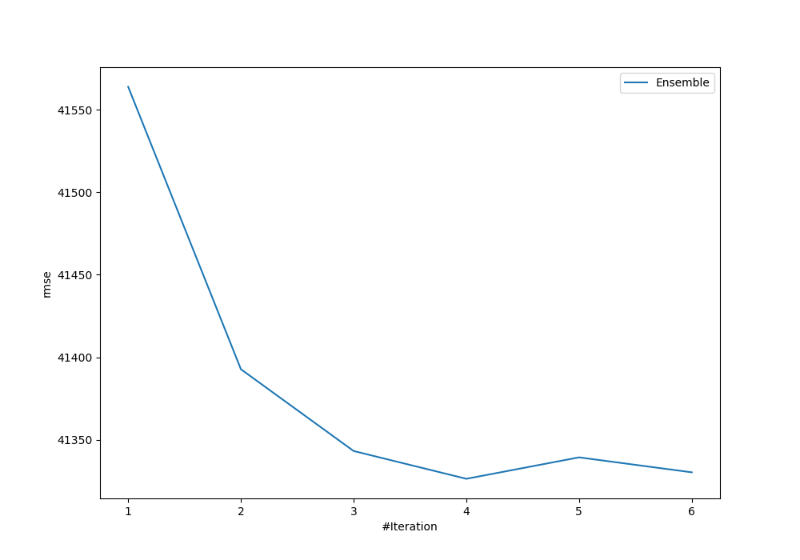
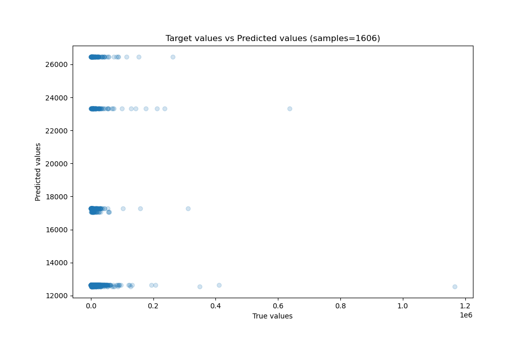
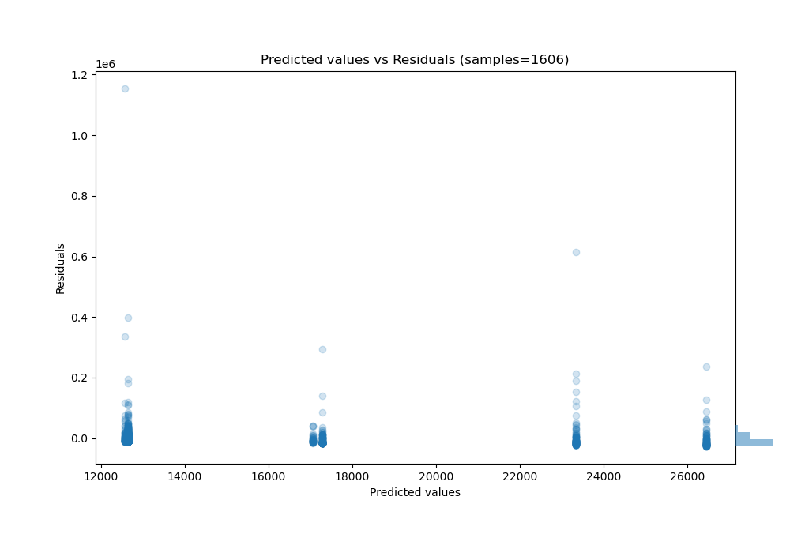

# Summary of Ensemble

[<< Go back](../README.md)

## Ensemble structure
| Model                  |   Weight |
|:-----------------------|---------:|
| 1_Baseline             |        1 |
| 2_DecisionTree         |        2 |
| 6_Default_RandomForest |        1 |

### Metric details:
| Metric   |           Score |
|:---------|----------------:|
| MAE      | 13747.1         |
| MSE      |     1.70788e+09 |
| RMSE     | 41326.5         |
| R2       |     0.010533    |
| MAPE     |     4.21494     |

## Learning curves

## True vs Predicted

## Predicted vs Residuals

[<< Go back](../README.md)
