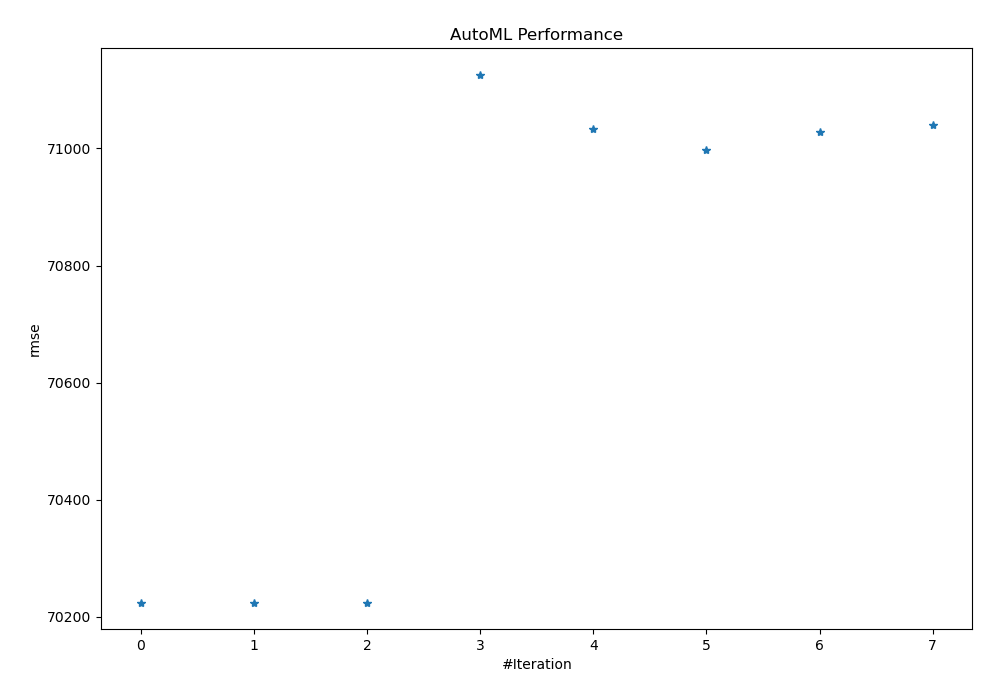
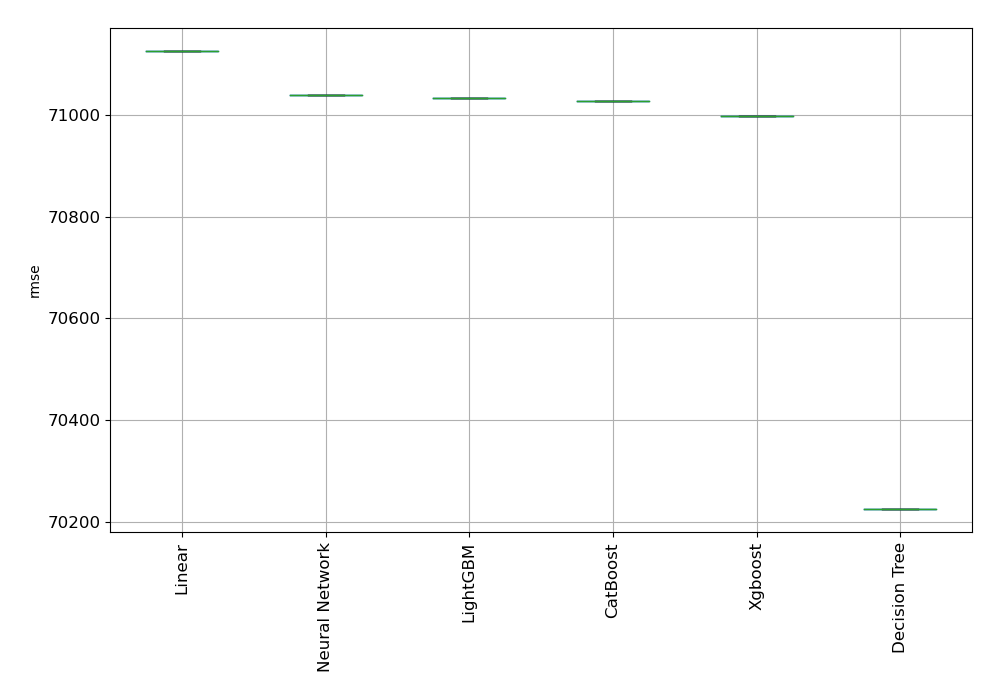

# AutoML Leaderboard

| Best model   | name                                                         | model_type     | metric_type   |   metric_value |   train_time |
|:-------------|:-------------------------------------------------------------|:---------------|:--------------|---------------:|-------------:|
| **the best** | [1_DecisionTree](1_DecisionTree/README.md)                   | Decision Tree  | rmse          |        70224.6 |         3.13 |
|              | [2_DecisionTree](2_DecisionTree/README.md)                   | Decision Tree  | rmse          |        70224.6 |         2.68 |
|              | [3_DecisionTree](3_DecisionTree/README.md)                   | Decision Tree  | rmse          |        70224.6 |         2.74 |
|              | [4_Linear](4_Linear/README.md)                               | Linear         | rmse          |        71126.2 |         3.49 |
|              | [5_Default_LightGBM](5_Default_LightGBM/README.md)           | LightGBM       | rmse          |        71033.2 |         7.14 |
|              | [6_Default_Xgboost](6_Default_Xgboost/README.md)             | Xgboost        | rmse          |        70998.1 |        30.72 |
|              | [7_Default_CatBoost](7_Default_CatBoost/README.md)           | CatBoost       | rmse          |        71028   |         7.63 |
|              | [8_Default_NeuralNetwork](8_Default_NeuralNetwork/README.md) | Neural Network | rmse          |        71039.5 |        13.47 |

### AutoML Performance

### AutoML Performance Boxplot
