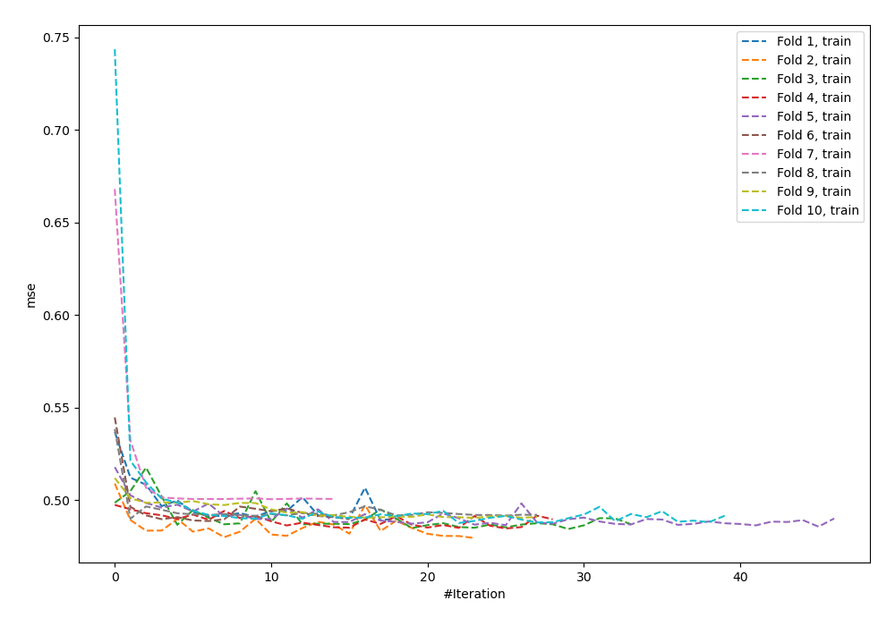
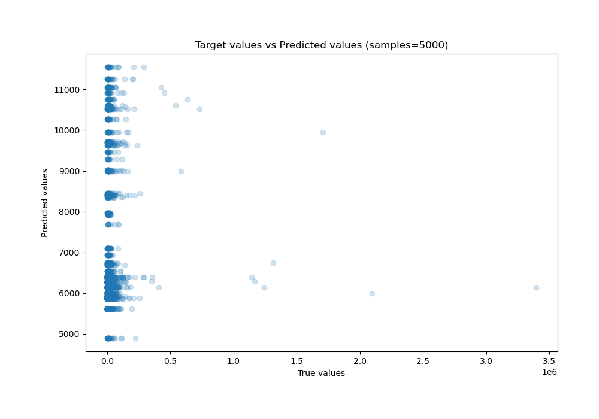
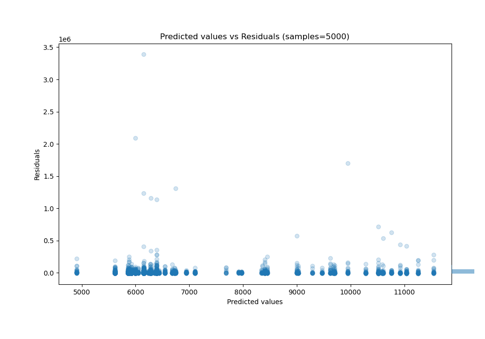

# Summary of 107_NeuralNetwork

[<< Go back](../README.md)

## Neural Network
- **n_jobs**: -1
- **dense_1_size**: 16
- **dense_2_size**: 4
- **learning_rate**: 0.01
- **explain_level**: 0

## Validation
 - **validation_type**: kfold
 - **shuffle**: True
 - **k_folds**: 10

## Optimized metric
r2

## Training time

22.7 seconds

### Metric details:
| Metric   |           Score |
|:---------|----------------:|
| MAE      | 13338.1         |
| MSE      |     5.04994e+09 |
| RMSE     | 71062.9         |
| R2       |    -0.0169066   |
| MAPE     |     1.57879     |

## Learning curves

## True vs Predicted

## Predicted vs Residuals

[<< Go back](../README.md)
