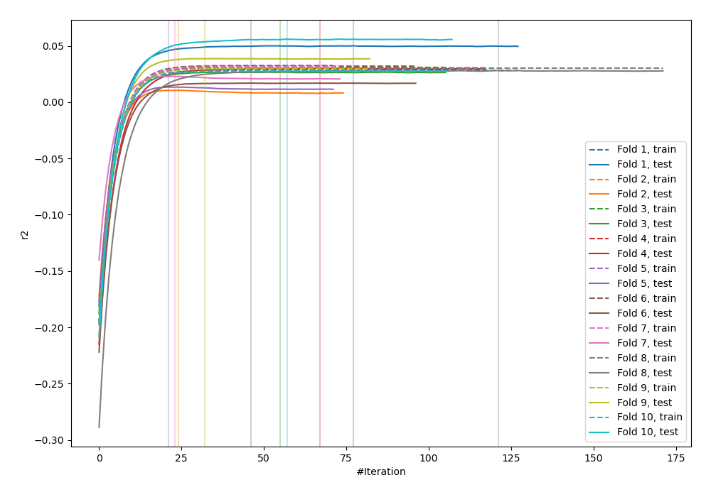
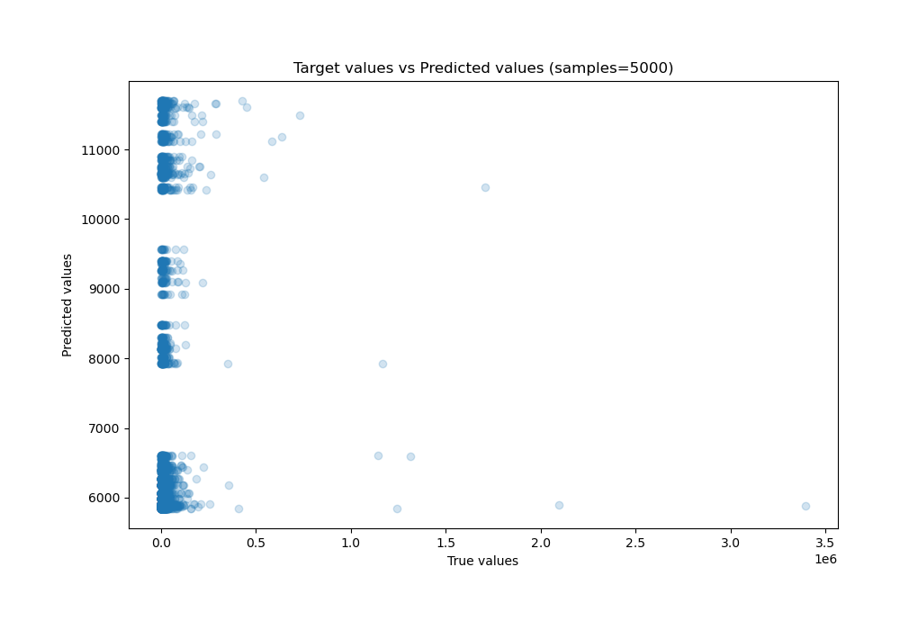
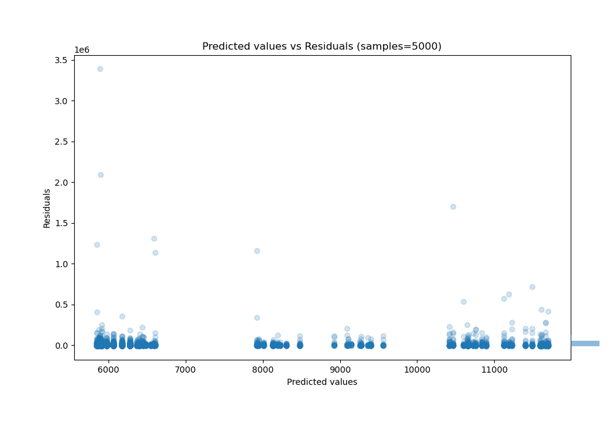

# Summary of 13_Xgboost

[<< Go back](../README.md)

## Extreme Gradient Boosting (Xgboost)
- **n_jobs**: -1
- **objective**: reg:squarederror
- **eta**: 0.1
- **max_depth**: 7
- **min_child_weight**: 25
- **subsample**: 0.9
- **colsample_bytree**: 0.6
- **eval_metric**: r2
- **explain_level**: 0

## Validation
 - **validation_type**: kfold
 - **shuffle**: True
 - **k_folds**: 10

## Optimized metric
r2

## Training time

23.2 seconds

### Metric details:
| Metric   |           Score |
|:---------|----------------:|
| MAE      | 13312.8         |
| MSE      |     5.04088e+09 |
| RMSE     | 70999.2         |
| R2       |    -0.0150831   |
| MAPE     |     1.61116     |

## Learning curves

## True vs Predicted

## Predicted vs Residuals

[<< Go back](../README.md)
