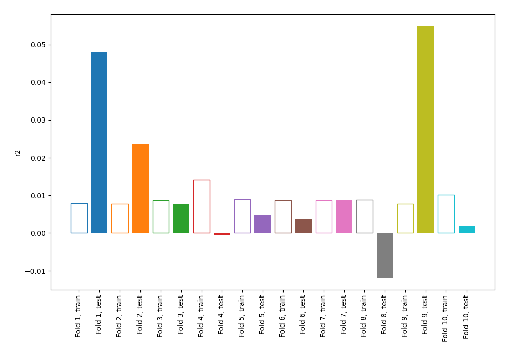
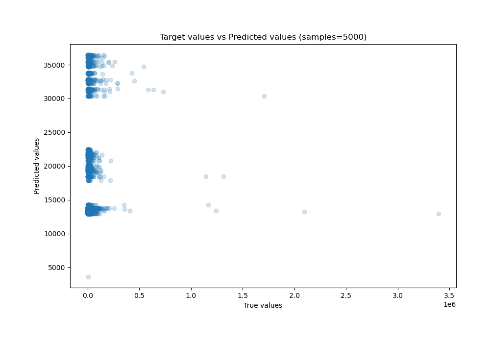
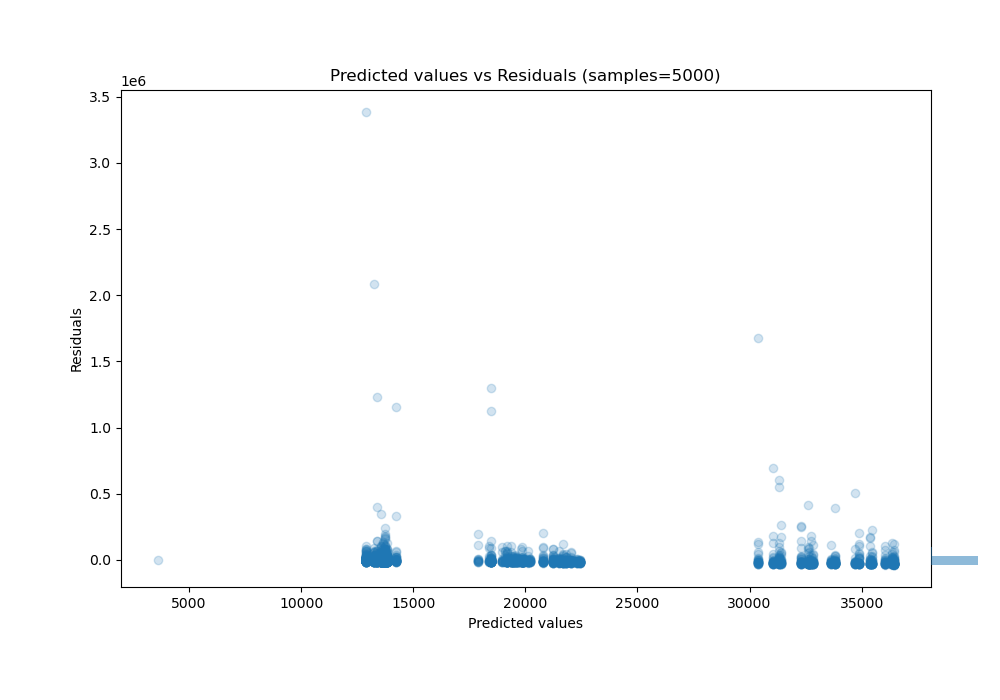

# Summary of 1_DecisionTree_BoostOnErrors

[<< Go back](../README.md)

## Decision Tree
- **n_jobs**: -1
- **criterion**: mse
- **max_depth**: 3
- **explain_level**: 0

## Validation
 - **validation_type**: kfold
 - **shuffle**: True
 - **k_folds**: 10

## Optimized metric
r2

## Training time

16.7 seconds

### Metric details:
| Metric   |           Score |
|:---------|----------------:|
| MAE      | 16664.9         |
| MSE      |     4.93239e+09 |
| RMSE     | 70231           |
| R2       |     0.00676332  |
| MAPE     |     4.32052     |

## Learning curves

## True vs Predicted

## Predicted vs Residuals

[<< Go back](../README.md)
