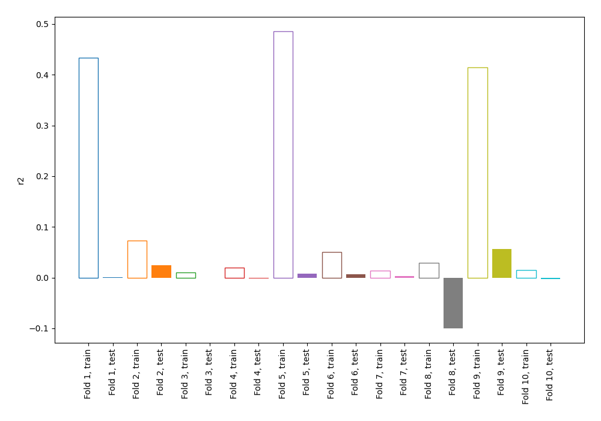
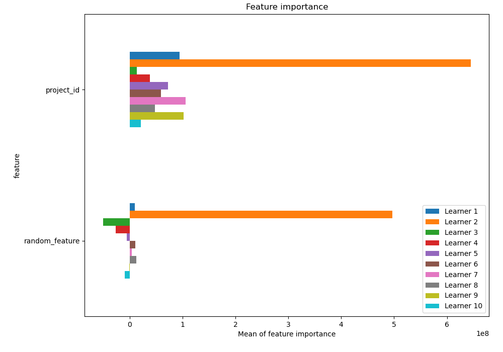
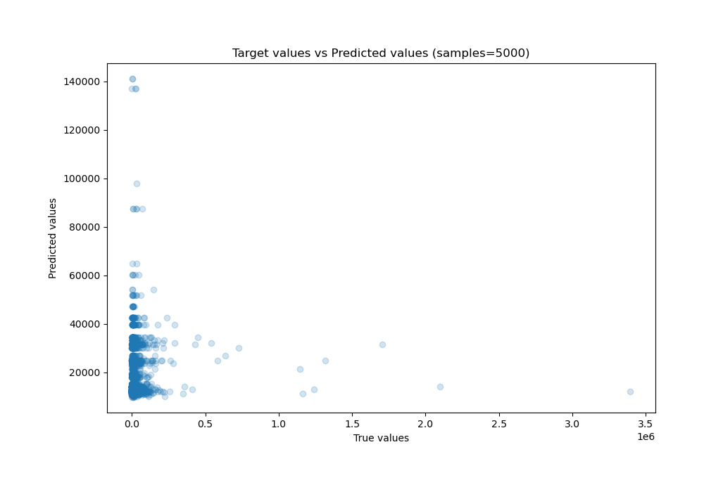
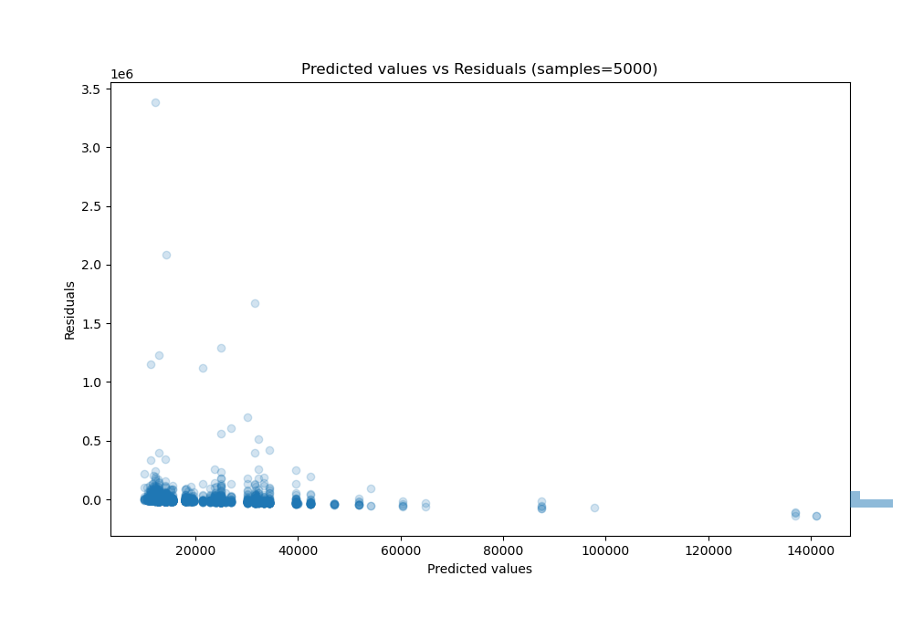

# Summary of 1_DecisionTree_RandomFeature

[<< Go back](../README.md)

## Decision Tree
- **n_jobs**: -1
- **criterion**: mse
- **max_depth**: 3
- **explain_level**: 1

## Validation
 - **validation_type**: kfold
 - **shuffle**: True
 - **k_folds**: 10

## Optimized metric
r2

## Training time

52.1 seconds

### Metric details:
| Metric   |           Score |
|:---------|----------------:|
| MAE      | 16481.7         |
| MSE      |     4.95865e+09 |
| RMSE     | 70417.6         |
| R2       |     0.0014771   |
| MAPE     |     4.12974     |

## Learning curves

## Permutation-based Importance

## True vs Predicted

## Predicted vs Residuals

[<< Go back](../README.md)
