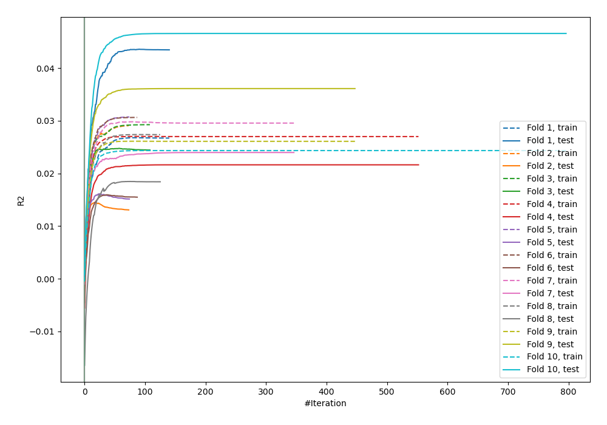
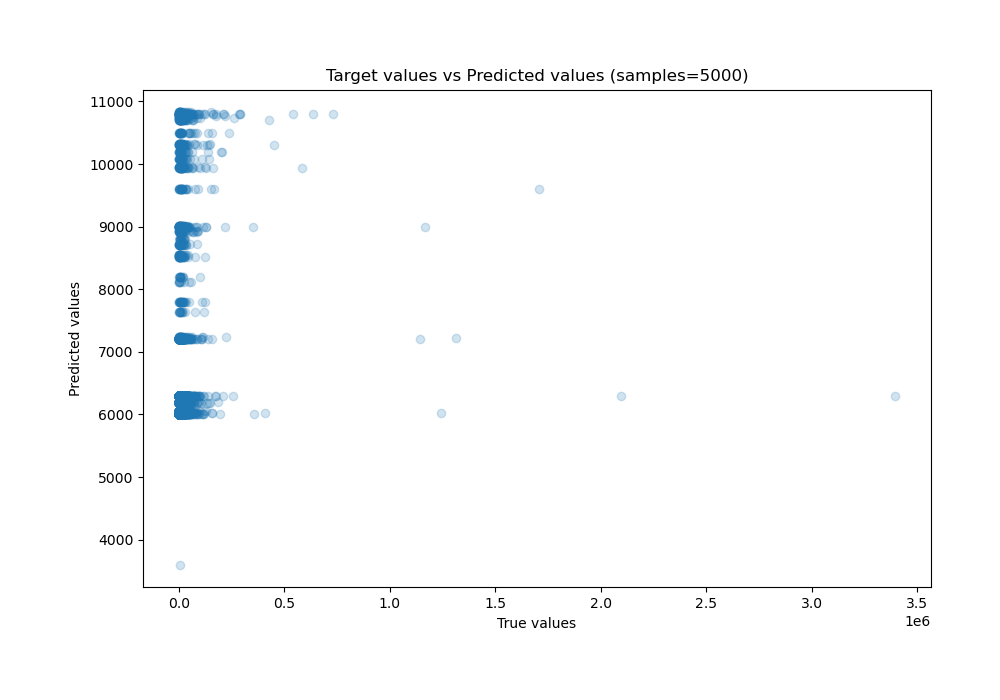
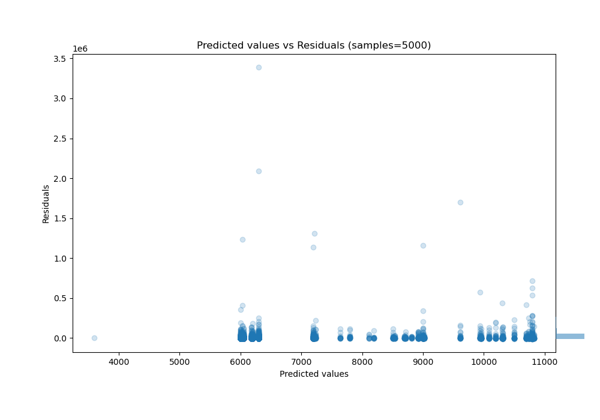

# Summary of 30_CatBoost

[<< Go back](../README.md)

## CatBoost
- **n_jobs**: -1
- **learning_rate**: 0.1
- **depth**: 8
- **rsm**: 1.0
- **loss_function**: MAE
- **eval_metric**: R2
- **explain_level**: 0

## Validation
 - **validation_type**: kfold
 - **shuffle**: True
 - **k_folds**: 10

## Optimized metric
r2

## Training time

7.9 seconds

### Metric details:
| Metric   |           Score |
|:---------|----------------:|
| MAE      | 13312           |
| MSE      |     5.04036e+09 |
| RMSE     | 70995.5         |
| R2       |    -0.0149769   |
| MAPE     |     1.65059     |

## Learning curves

## True vs Predicted

## Predicted vs Residuals

[<< Go back](../README.md)
