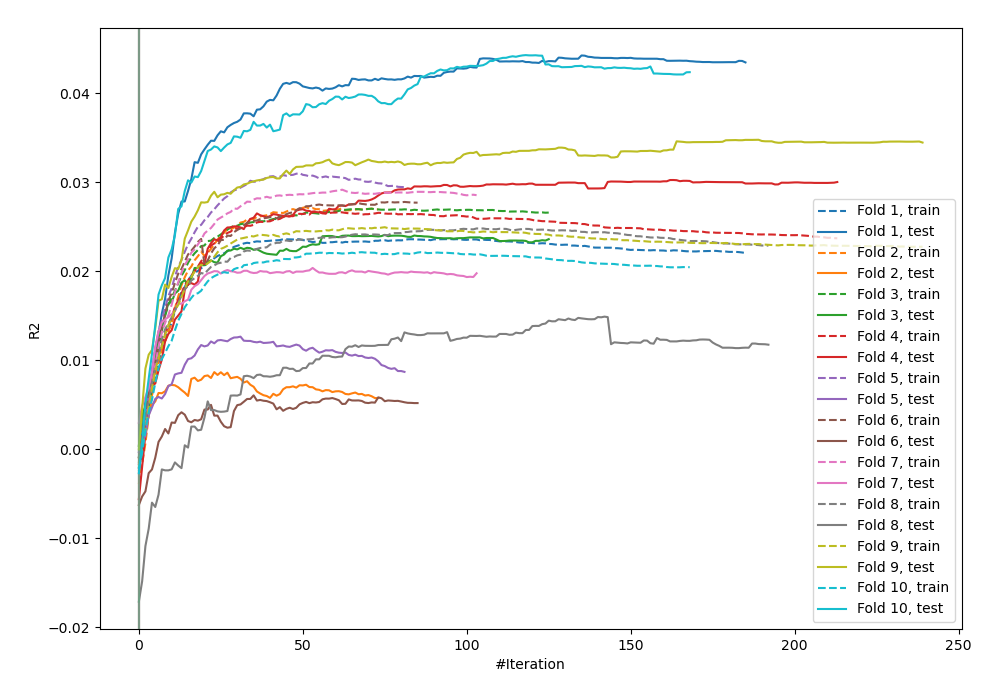
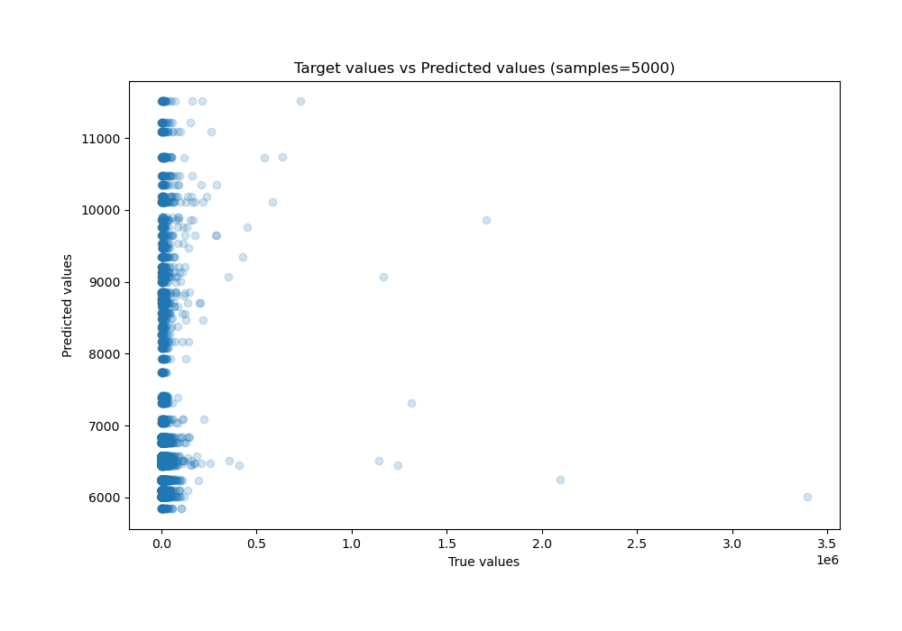
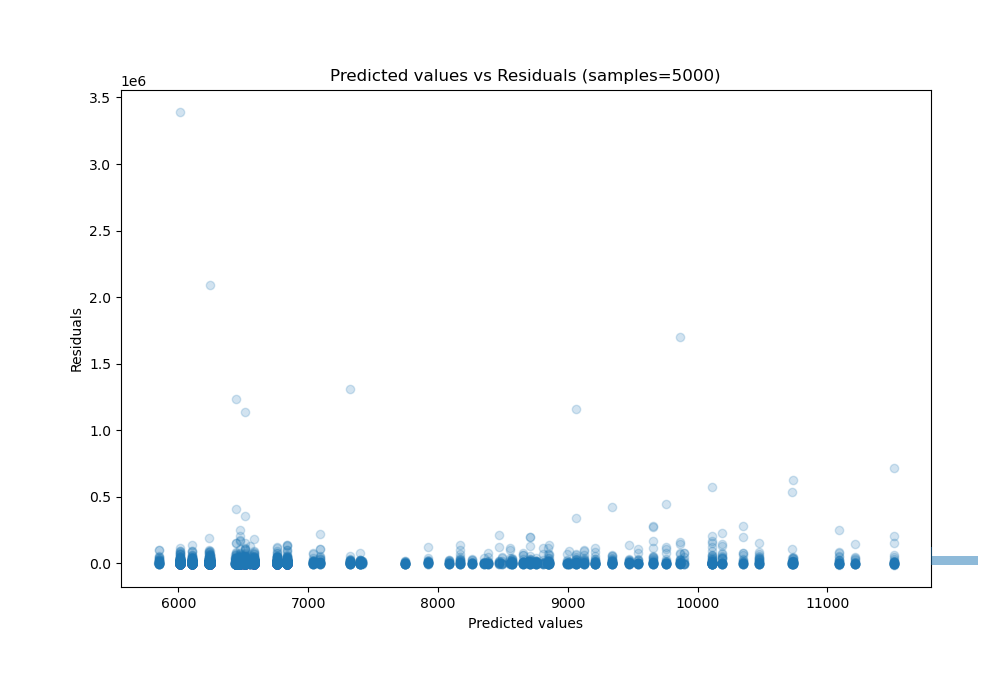

# Summary of 34_CatBoost_Stacked

[<< Go back](../README.md)

## CatBoost
- **n_jobs**: -1
- **learning_rate**: 0.1
- **depth**: 4
- **rsm**: 0.7
- **loss_function**: MAPE
- **eval_metric**: R2
- **explain_level**: 0

## Validation
 - **validation_type**: kfold
 - **shuffle**: True
 - **k_folds**: 10

## Optimized metric
r2

## Training time

26.2 seconds

### Metric details:
| Metric   |           Score |
|:---------|----------------:|
| MAE      | 13315.2         |
| MSE      |     5.04129e+09 |
| RMSE     | 71002           |
| R2       |    -0.0151649   |
| MAPE     |     1.67642     |

## Learning curves

## True vs Predicted

## Predicted vs Residuals

[<< Go back](../README.md)
