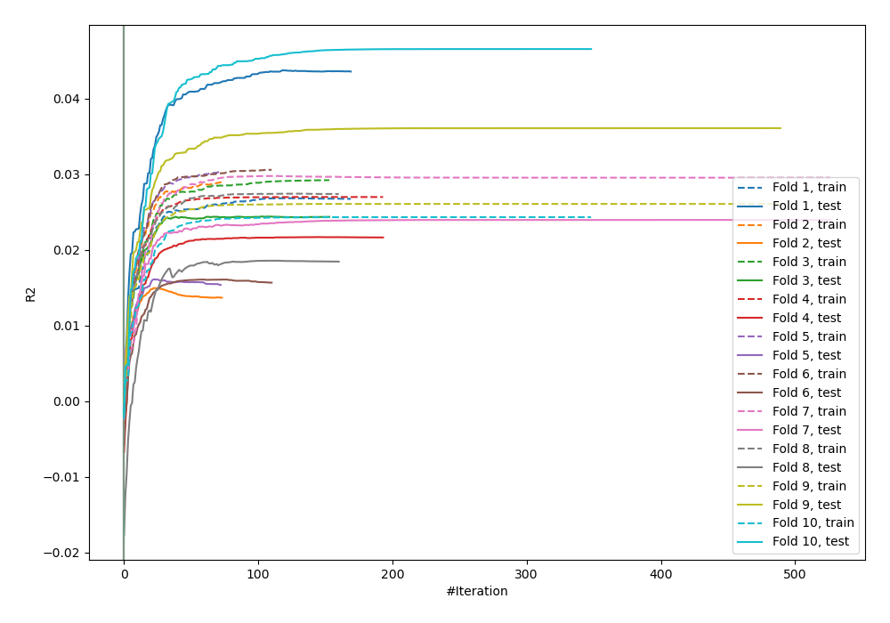
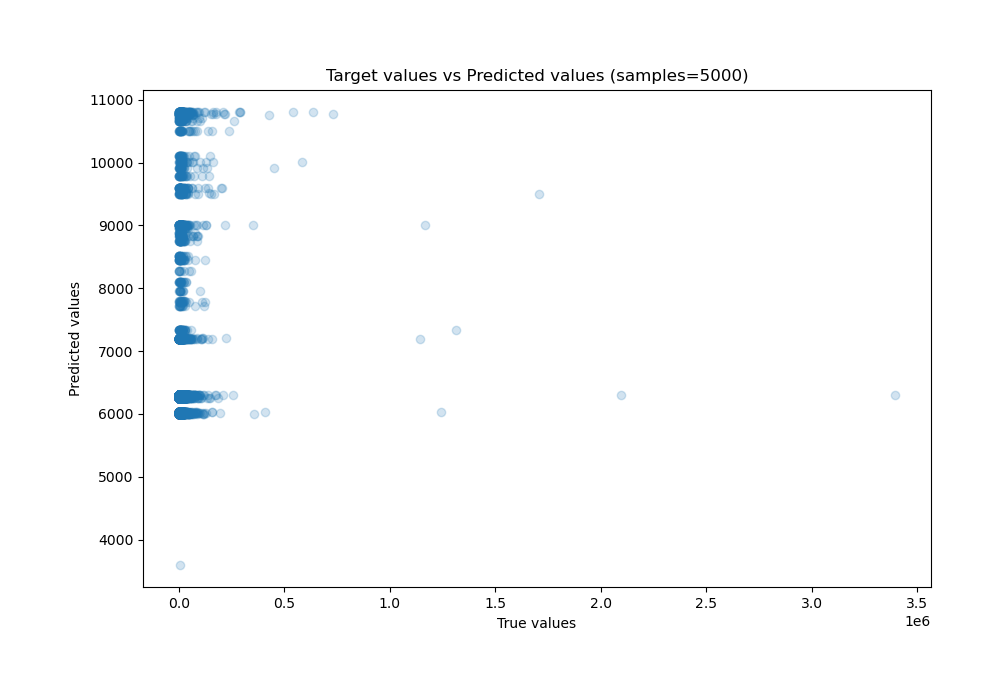
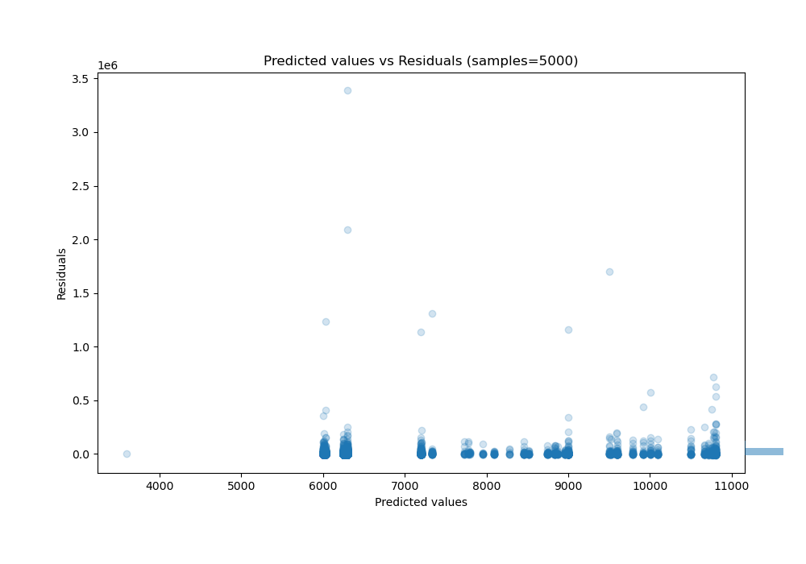

# Summary of 36_CatBoost

[<< Go back](../README.md)

## CatBoost
- **n_jobs**: -1
- **learning_rate**: 0.1
- **depth**: 7
- **rsm**: 0.8
- **loss_function**: MAE
- **eval_metric**: R2
- **explain_level**: 0

## Validation
 - **validation_type**: kfold
 - **shuffle**: True
 - **k_folds**: 10

## Optimized metric
r2

## Training time

11.5 seconds

### Metric details:
| Metric   |           Score |
|:---------|----------------:|
| MAE      | 13310.3         |
| MSE      |     5.04091e+09 |
| RMSE     | 70999.4         |
| R2       |    -0.0150886   |
| MAPE     |     1.64876     |

## Learning curves

## True vs Predicted

## Predicted vs Residuals

[<< Go back](../README.md)
