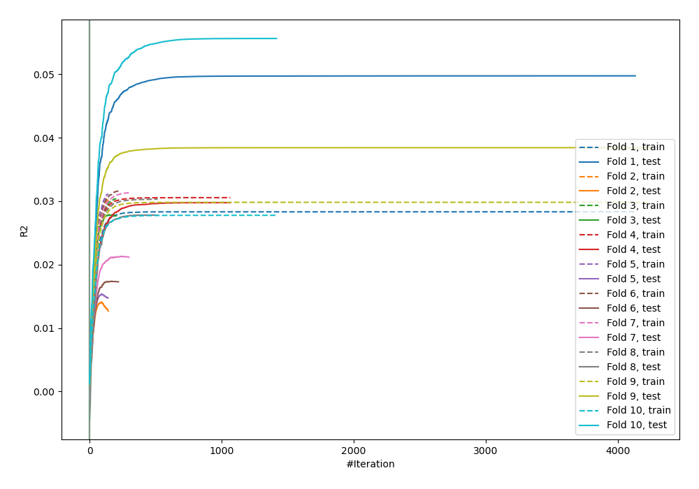
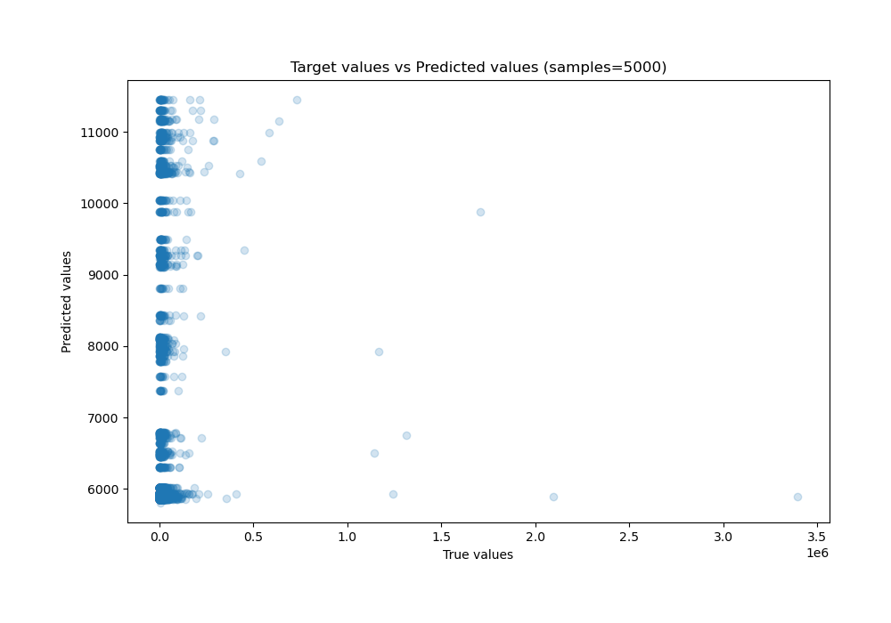
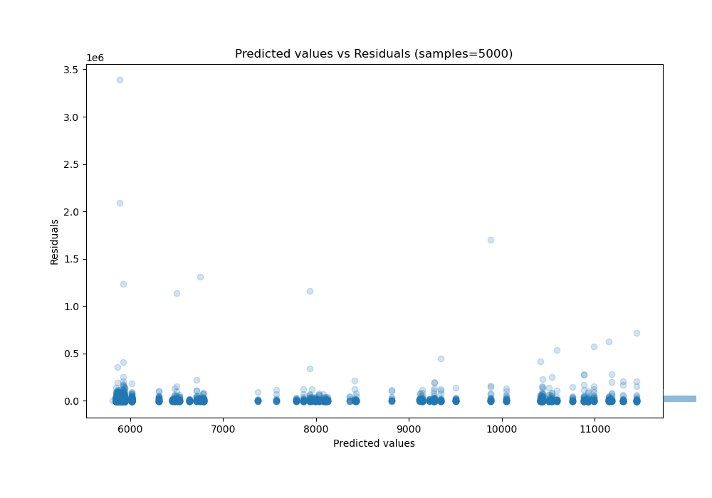

# Summary of 37_CatBoost

[<< Go back](../README.md)

## CatBoost
- **n_jobs**: -1
- **learning_rate**: 0.025
- **depth**: 7
- **rsm**: 0.7
- **loss_function**: RMSE
- **eval_metric**: R2
- **explain_level**: 0

## Validation
 - **validation_type**: kfold
 - **shuffle**: True
 - **k_folds**: 10

## Optimized metric
r2

## Training time

20.2 seconds

### Metric details:
| Metric   |           Score |
|:---------|----------------:|
| MAE      | 13306.5         |
| MSE      |     5.04504e+09 |
| RMSE     | 71028.4         |
| R2       |    -0.01592     |
| MAPE     |     1.58084     |

## Learning curves

## True vs Predicted

## Predicted vs Residuals

[<< Go back](../README.md)
