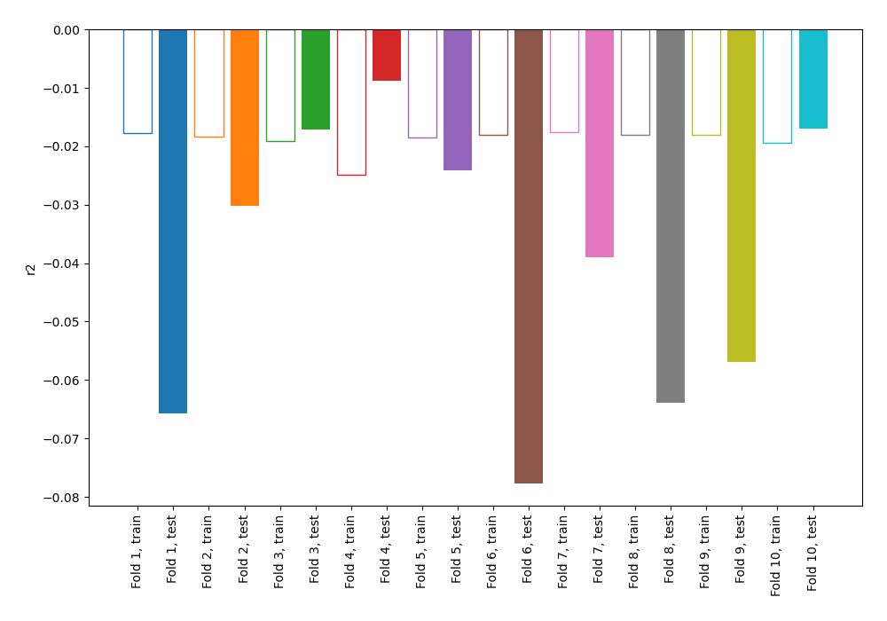
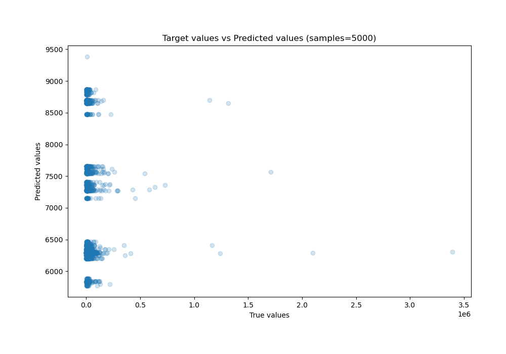
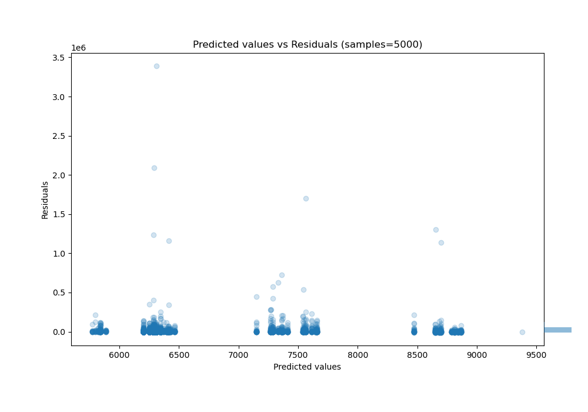

# Summary of 4_Linear

[<< Go back](../README.md)

## Linear Regression (Linear)
- **n_jobs**: -1
- **explain_level**: 0

## Validation
 - **validation_type**: kfold
 - **shuffle**: True
 - **k_folds**: 10

## Optimized metric
r2

## Training time

2.9 seconds

### Metric details:
| Metric   |           Score |
|:---------|----------------:|
| MAE      | 13382.6         |
| MSE      |     5.05894e+09 |
| RMSE     | 71126.2         |
| R2       |    -0.0187195   |
| MAPE     |     1.61143     |

## Learning curves

## True vs Predicted

## Predicted vs Residuals

[<< Go back](../README.md)
