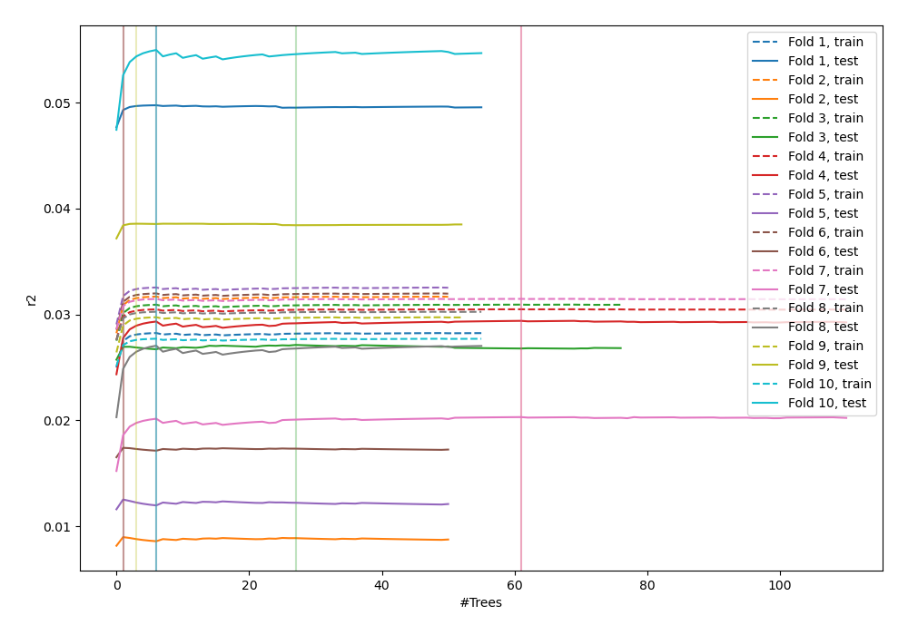
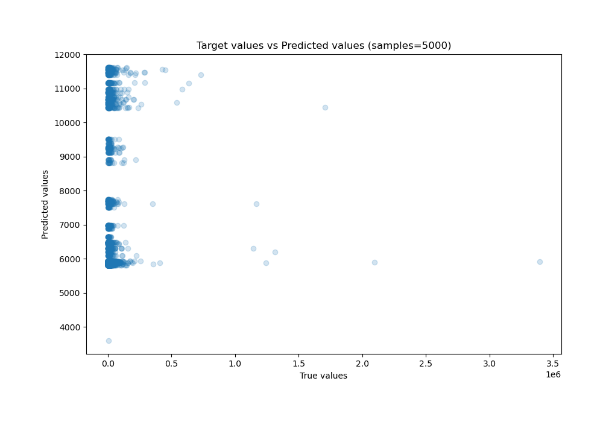
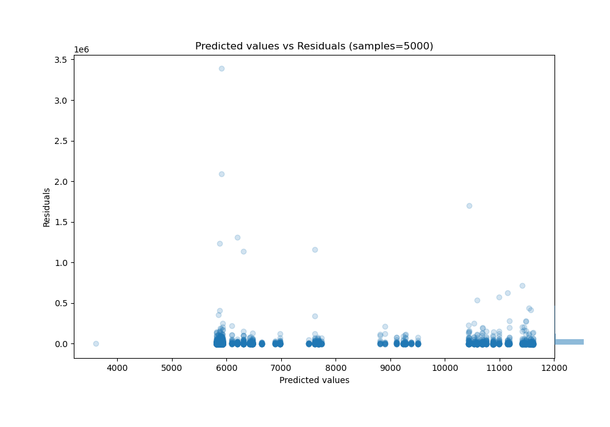

# Summary of 53_ExtraTrees

[<< Go back](../README.md)

## Extra Trees Regressor (Extra Trees)
- **n_jobs**: -1
- **criterion**: mse
- **max_features**: 0.7
- **min_samples_split**: 50
- **max_depth**: 4
- **eval_metric_name**: r2
- **explain_level**: 0

## Validation
 - **validation_type**: kfold
 - **shuffle**: True
 - **k_folds**: 10

## Optimized metric
r2

## Training time

12.8 seconds

### Metric details:
| Metric   |           Score |
|:---------|----------------:|
| MAE      | 13320.9         |
| MSE      |     5.04309e+09 |
| RMSE     | 71014.8         |
| R2       |    -0.0155286   |
| MAPE     |     1.58472     |

## Learning curves

## True vs Predicted

## Predicted vs Residuals

[<< Go back](../README.md)
