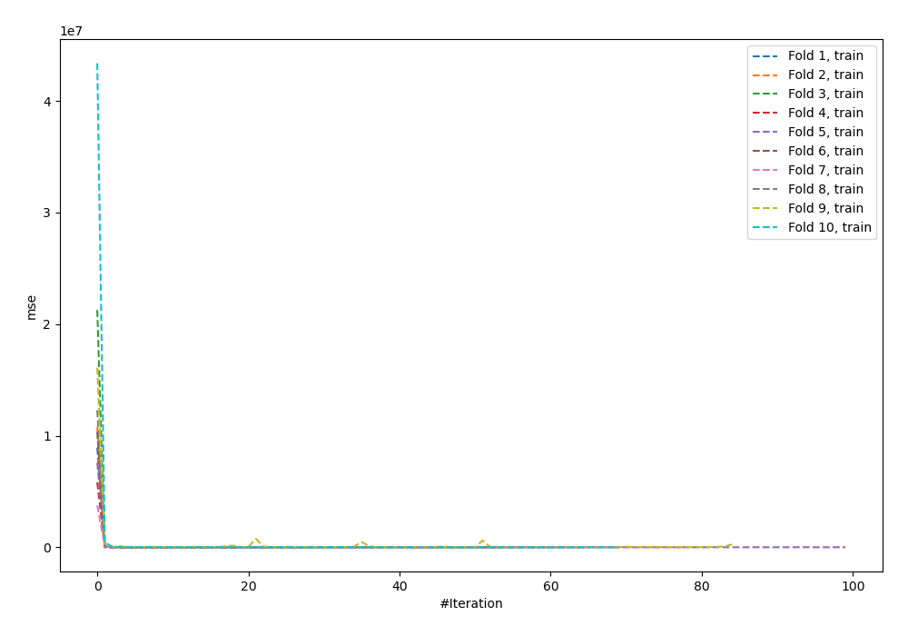
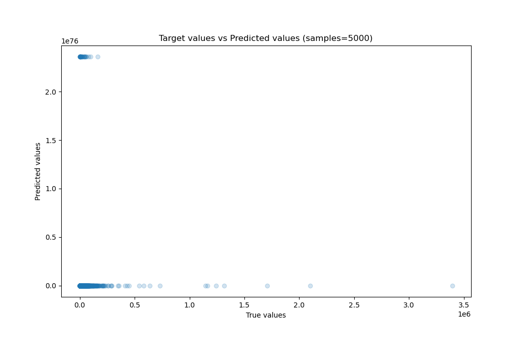
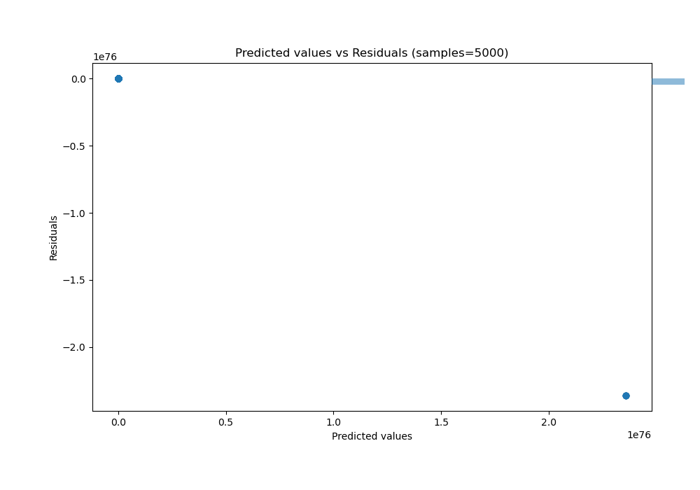

# Summary of 60_NeuralNetwork_Stacked

[<< Go back](../README.md)

## Neural Network
- **n_jobs**: -1
- **dense_1_size**: 64
- **dense_2_size**: 16
- **learning_rate**: 0.01
- **explain_level**: 0

## Validation
 - **validation_type**: kfold
 - **shuffle**: True
 - **k_folds**: 10

## Optimized metric
r2

## Training time

69.2 seconds

### Metric details:
| Metric   |         Score |
|:---------|--------------:|
| MAE      |  1.46878e+74  |
| MSE      |  3.46446e+150 |
| RMSE     |  1.86131e+75  |
| R2       | -6.97639e+140 |
| MAPE     |  4.36808e+70  |

## Learning curves

## True vs Predicted

## Predicted vs Residuals

[<< Go back](../README.md)
