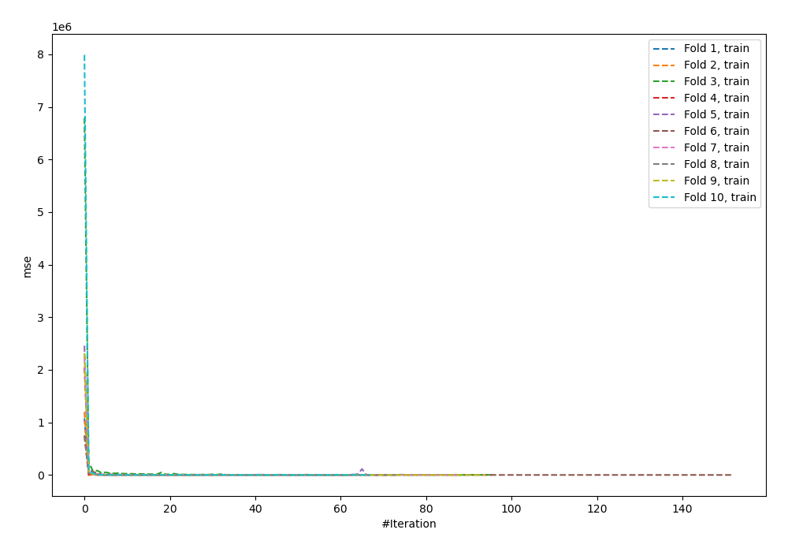
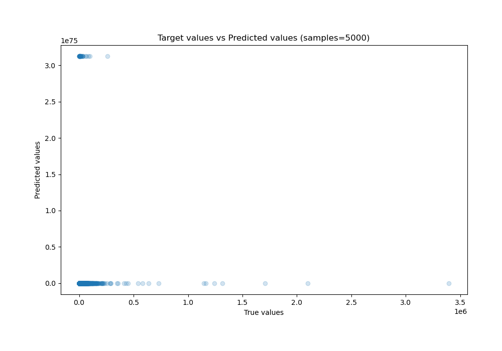
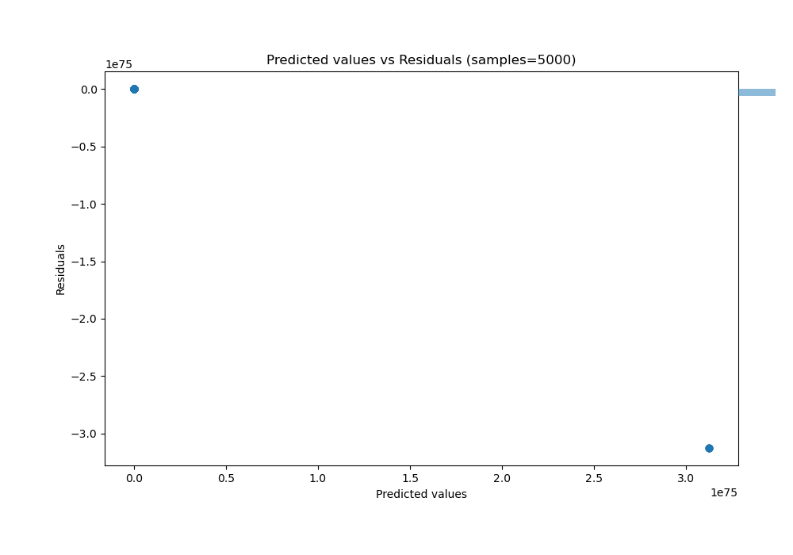

# Summary of 62_NeuralNetwork_Stacked

[<< Go back](../README.md)

## Neural Network
- **n_jobs**: -1
- **dense_1_size**: 16
- **dense_2_size**: 16
- **learning_rate**: 0.01
- **explain_level**: 0

## Validation
 - **validation_type**: kfold
 - **shuffle**: True
 - **k_folds**: 10

## Optimized metric
r2

## Training time

61.7 seconds

### Metric details:
| Metric   |         Score |
|:---------|--------------:|
| MAE      |  1.75078e+73  |
| MSE      |  5.46974e+148 |
| RMSE     |  2.33875e+74  |
| R2       | -1.10144e+139 |
| MAPE     |  3.44338e+69  |

## Learning curves

## True vs Predicted

## Predicted vs Residuals

[<< Go back](../README.md)
