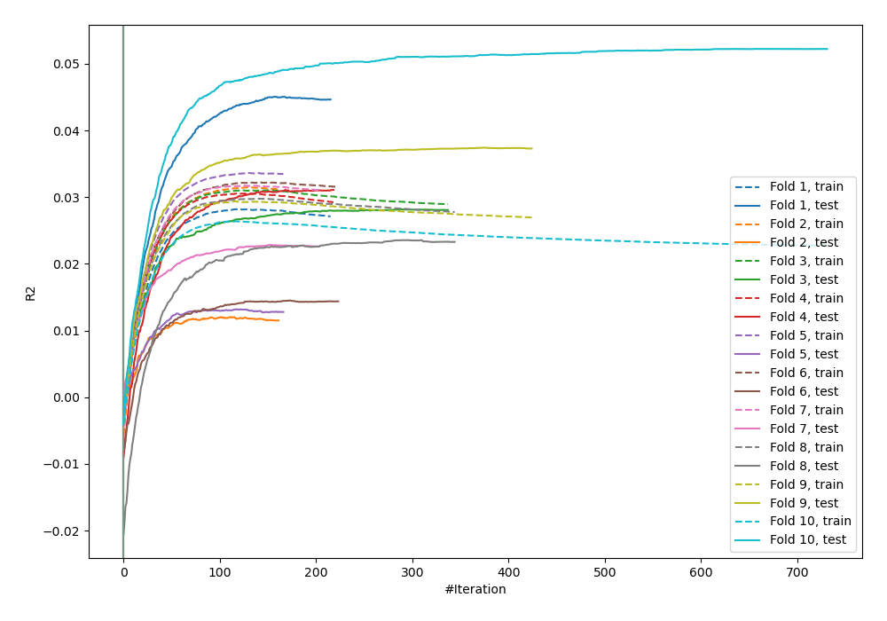
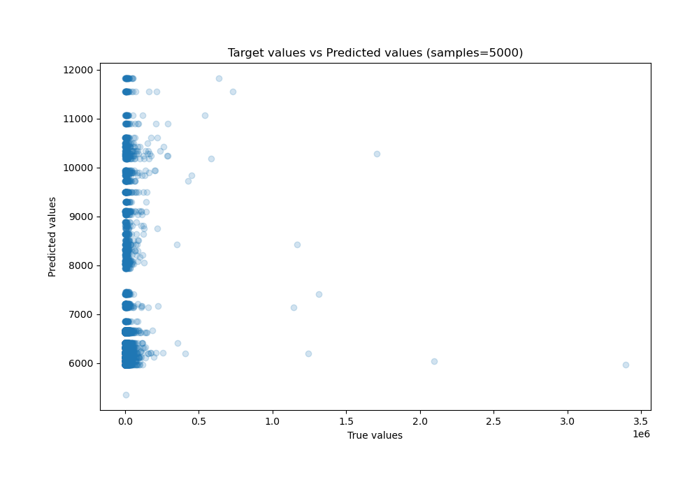
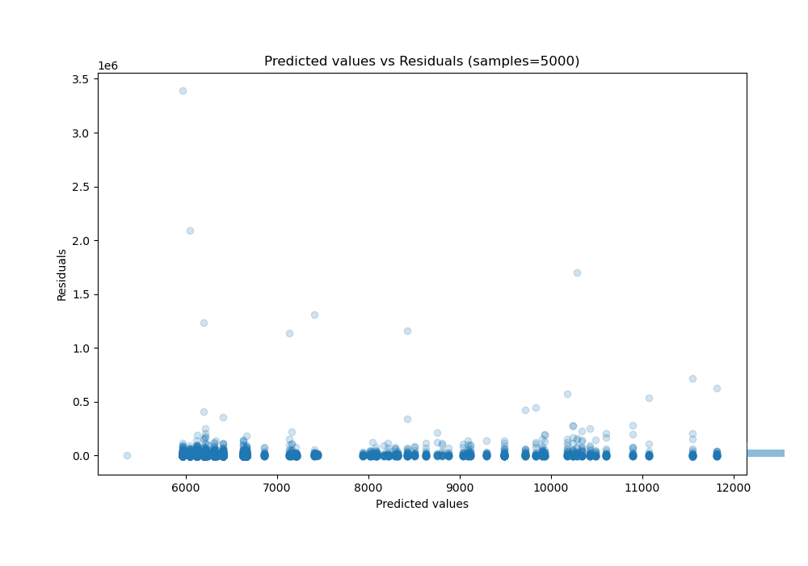

# Summary of 70_CatBoost_Stacked

[<< Go back](../README.md)

## CatBoost
- **n_jobs**: -1
- **learning_rate**: 0.025
- **depth**: 9
- **rsm**: 1.0
- **loss_function**: MAE
- **eval_metric**: R2
- **explain_level**: 0

## Validation
 - **validation_type**: kfold
 - **shuffle**: True
 - **k_folds**: 10

## Optimized metric
r2

## Training time

86.0 seconds

### Metric details:
| Metric   |          Score |
|:---------|---------------:|
| MAE      | 13305.5        |
| MSE      |     5.0411e+09 |
| RMSE     | 71000.7        |
| R2       |    -0.0151267  |
| MAPE     |     1.64652    |

## Learning curves

## True vs Predicted

## Predicted vs Residuals

[<< Go back](../README.md)
