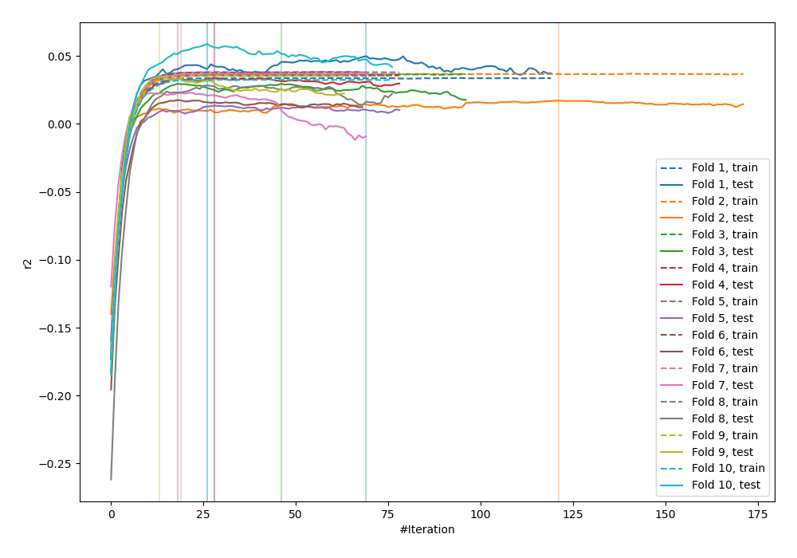
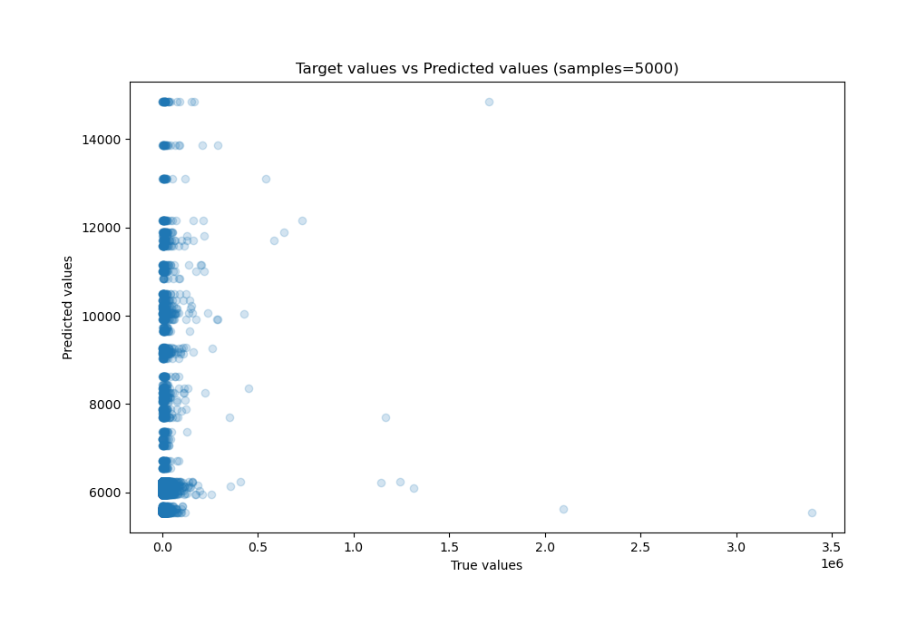
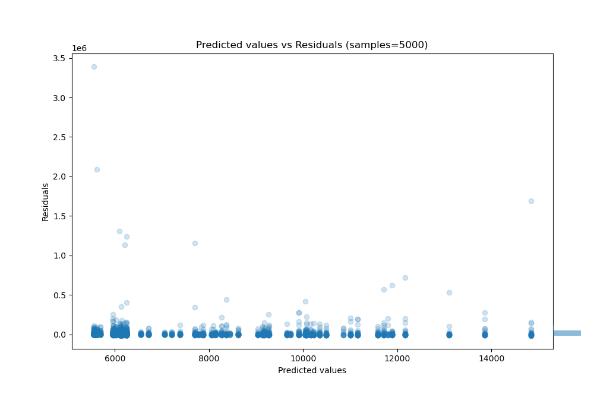

# Summary of 73_Xgboost_Stacked

[<< Go back](../README.md)

## Extreme Gradient Boosting (Xgboost)
- **n_jobs**: -1
- **objective**: reg:squarederror
- **eta**: 0.15
- **max_depth**: 7
- **min_child_weight**: 50
- **subsample**: 0.6
- **colsample_bytree**: 0.6
- **eval_metric**: r2
- **explain_level**: 0

## Validation
 - **validation_type**: kfold
 - **shuffle**: True
 - **k_folds**: 10

## Optimized metric
r2

## Training time

71.6 seconds

### Metric details:
| Metric   |           Score |
|:---------|----------------:|
| MAE      | 13309.8         |
| MSE      |     5.03921e+09 |
| RMSE     | 70987.4         |
| R2       |    -0.0147468   |
| MAPE     |     1.60042     |

## Learning curves

## True vs Predicted

## Predicted vs Residuals

[<< Go back](../README.md)
