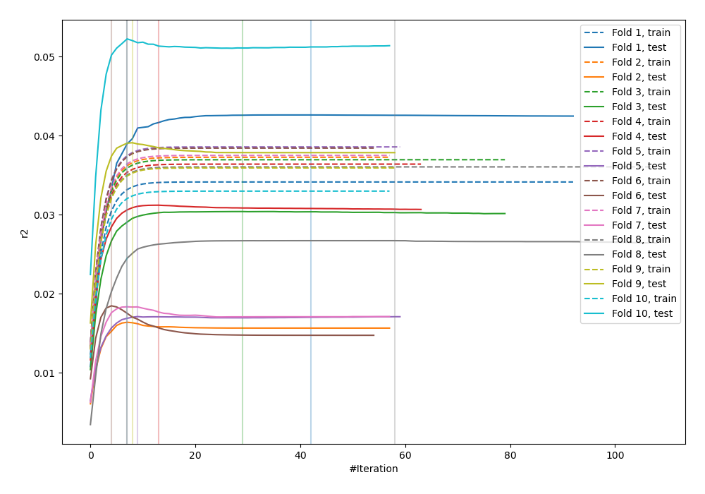
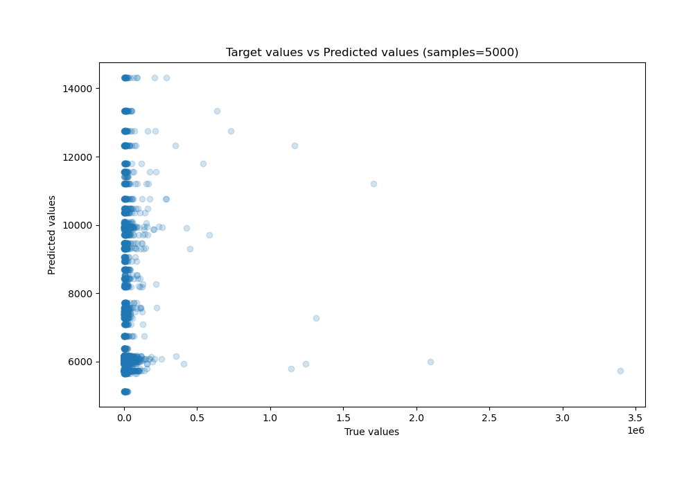
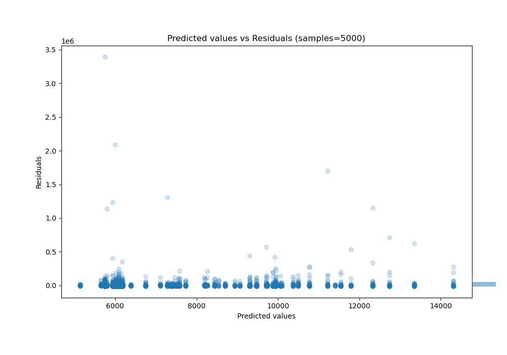

# Summary of 93_LightGBM_Stacked

[<< Go back](../README.md)

## LightGBM
- **n_jobs**: -1
- **objective**: regression
- **num_leaves**: 31
- **learning_rate**: 0.2
- **feature_fraction**: 0.8
- **bagging_fraction**: 0.8
- **min_data_in_leaf**: 5
- **metric**: custom
- **custom_eval_metric_name**: r2
- **explain_level**: 0

## Validation
 - **validation_type**: kfold
 - **shuffle**: True
 - **k_folds**: 10

## Optimized metric
r2

## Training time

27.8 seconds

### Metric details:
| Metric   |           Score |
|:---------|----------------:|
| MAE      | 13314.7         |
| MSE      |     5.03997e+09 |
| RMSE     | 70992.8         |
| R2       |    -0.0148996   |
| MAPE     |     1.60014     |

## Learning curves

## True vs Predicted

## Predicted vs Residuals

[<< Go back](../README.md)
