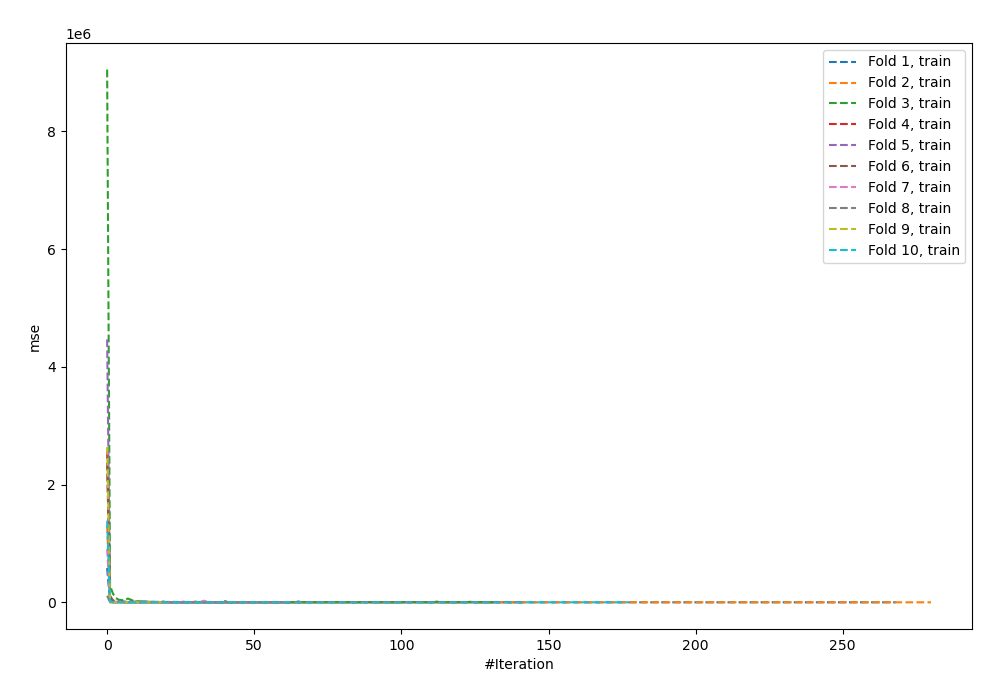
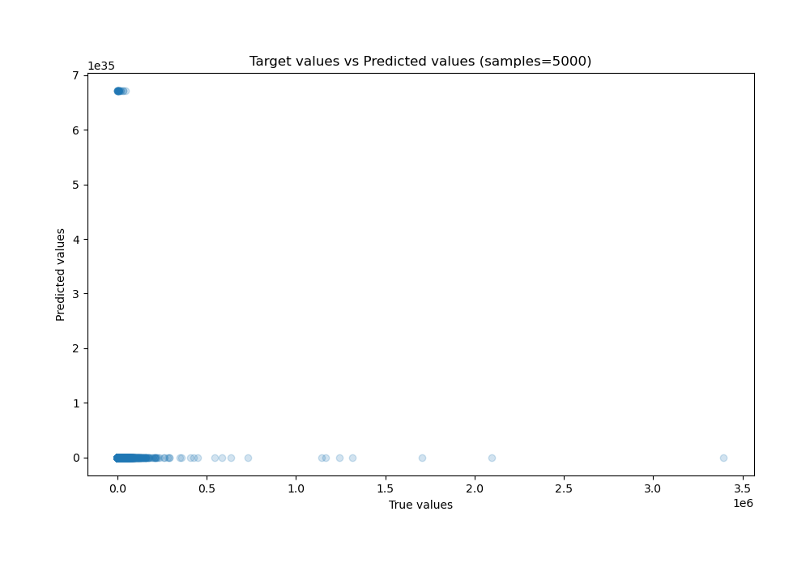
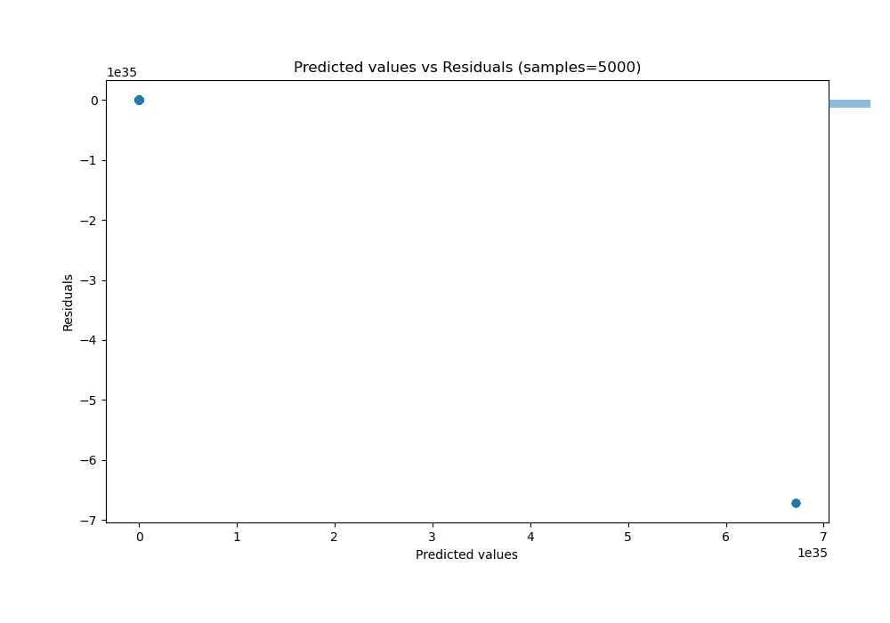

# Summary of 94_NeuralNetwork_Stacked

[<< Go back](../README.md)

## Neural Network
- **n_jobs**: -1
- **dense_1_size**: 16
- **dense_2_size**: 8
- **learning_rate**: 0.01
- **explain_level**: 0

## Validation
 - **validation_type**: kfold
 - **shuffle**: True
 - **k_folds**: 10

## Optimized metric
r2

## Training time

75.3 seconds

### Metric details:
| Metric   |        Score |
|:---------|-------------:|
| MAE      |  2.92522e+33 |
| MSE      |  1.96319e+69 |
| RMSE     |  4.43079e+34 |
| R2       | -3.95327e+59 |
| MAPE     |  7.42252e+29 |

## Learning curves

## True vs Predicted

## Predicted vs Residuals

[<< Go back](../README.md)
