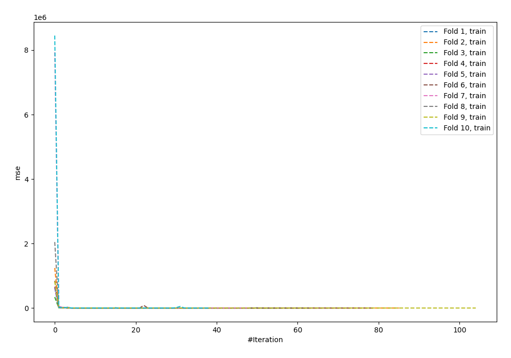
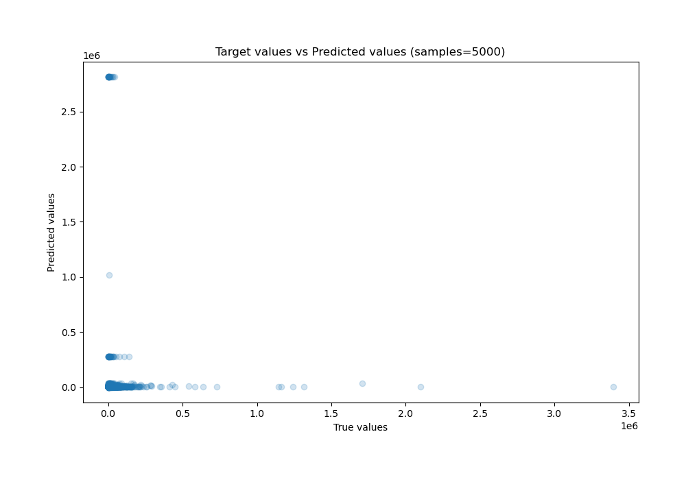
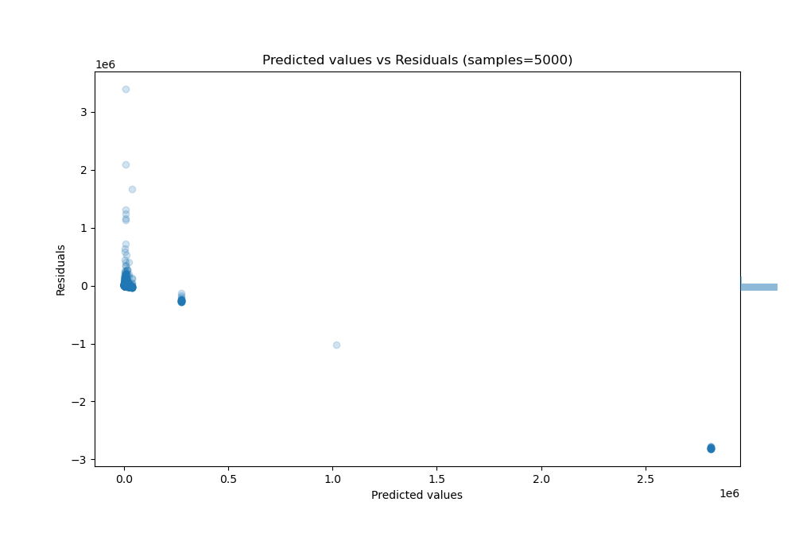

# Summary of 95_NeuralNetwork_Stacked

[<< Go back](../README.md)

## Neural Network
- **n_jobs**: -1
- **dense_1_size**: 16
- **dense_2_size**: 32
- **learning_rate**: 0.01
- **explain_level**: 0

## Validation
 - **validation_type**: kfold
 - **shuffle**: True
 - **k_folds**: 10

## Optimized metric
r2

## Training time

48.1 seconds

### Metric details:
| Metric   |        Score |
|:---------|-------------:|
| MAE      |  1.12168e+17 |
| MSE      |  8.0825e+37  |
| RMSE     |  8.99027e+18 |
| R2       | -1.62757e+28 |
| MAPE     |  3.11579e+13 |

## Learning curves

## True vs Predicted

## Predicted vs Residuals

[<< Go back](../README.md)
