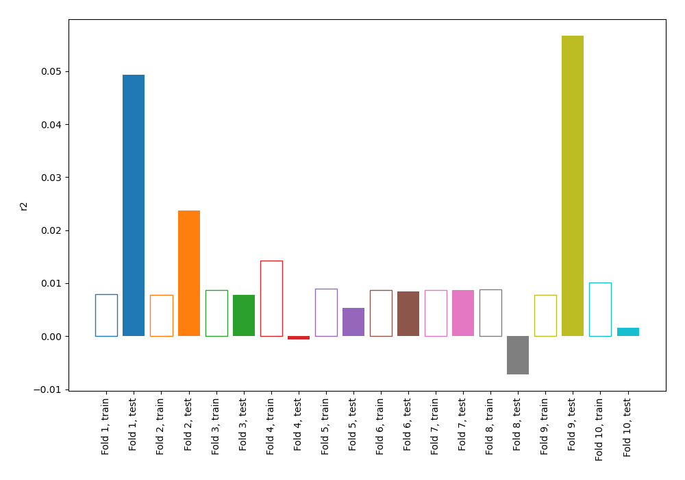
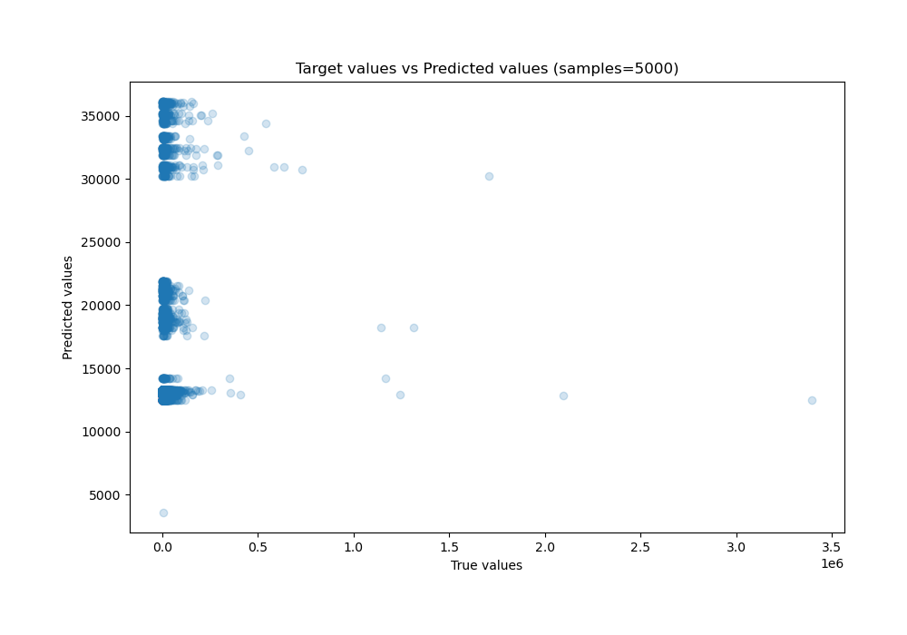
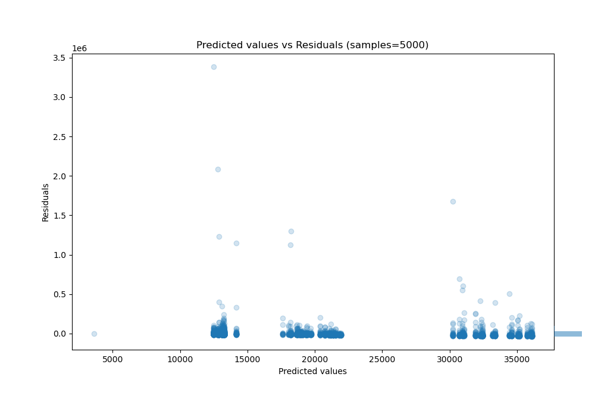

# Summary of 98_DecisionTree

[<< Go back](../README.md)

## Decision Tree
- **n_jobs**: -1
- **criterion**: friedman_mse
- **max_depth**: 4
- **explain_level**: 0

## Validation
 - **validation_type**: kfold
 - **shuffle**: True
 - **k_folds**: 10

## Optimized metric
r2

## Training time

17.8 seconds

### Metric details:
| Metric   |           Score |
|:---------|----------------:|
| MAE      | 16423.6         |
| MSE      |     4.93149e+09 |
| RMSE     | 70224.6         |
| R2       |     0.00694503  |
| MAPE     |     4.18236     |

## Learning curves

## True vs Predicted

## Predicted vs Residuals

[<< Go back](../README.md)
