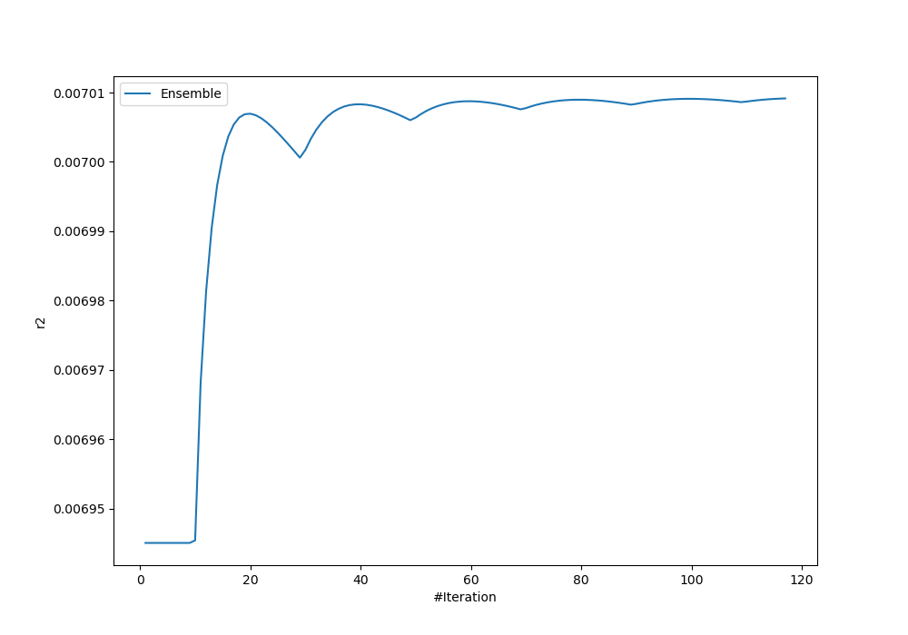
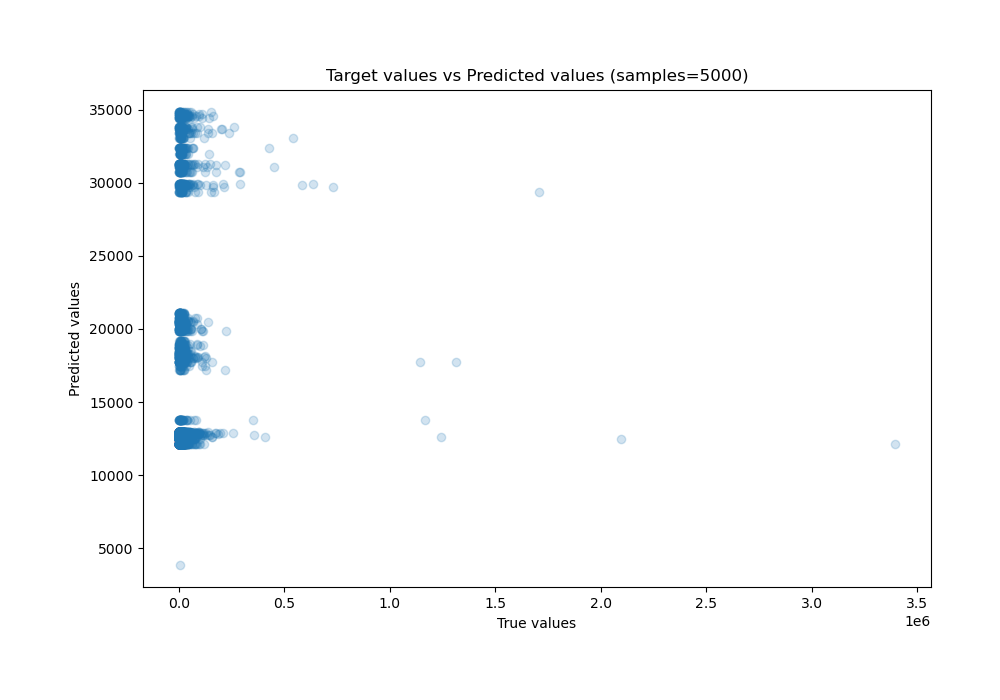
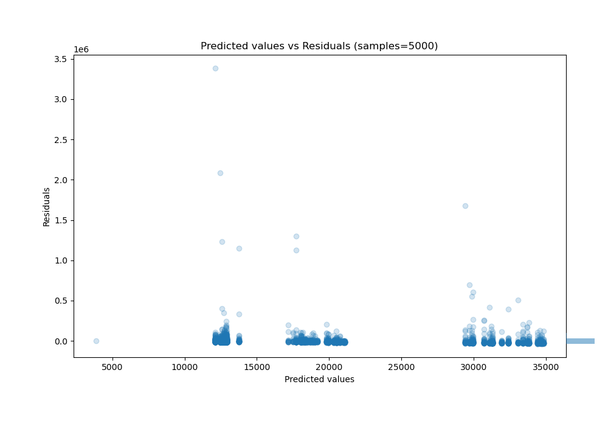

# Summary of Ensemble

[<< Go back](../README.md)

## Ensemble structure
| Model                        |   Weight |
|:-----------------------------|---------:|
| 1_DecisionTree               |      110 |
| 1_DecisionTree_BoostOnErrors |        1 |
| 8_Default_NeuralNetwork      |        6 |

### Metric details:
| Metric   |           Score |
|:---------|----------------:|
| MAE      | 16154.3         |
| MSE      |     4.93117e+09 |
| RMSE     | 70222.3         |
| R2       |     0.00700915  |
| MAPE     |     4.03972     |

## Learning curves

## True vs Predicted

## Predicted vs Residuals

[<< Go back](../README.md)
