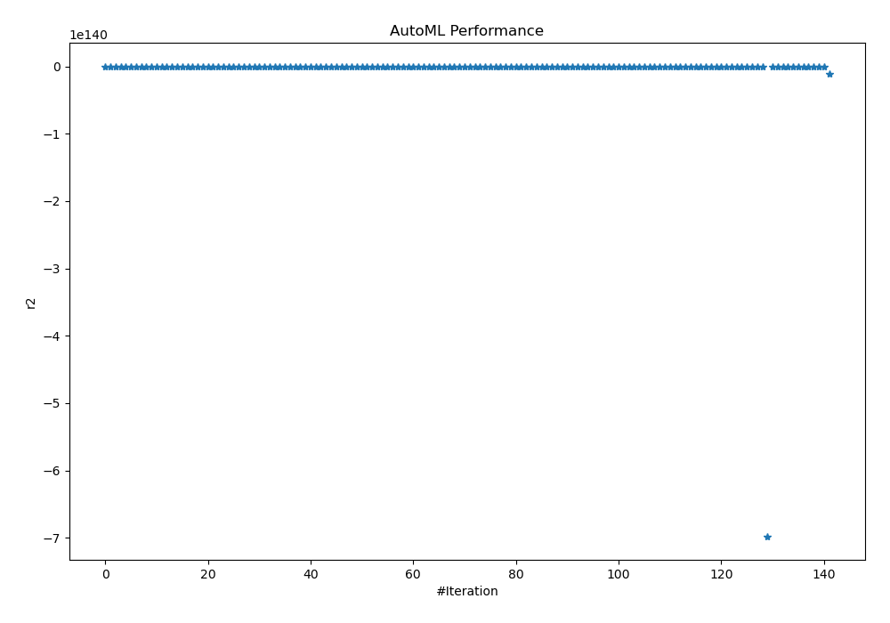
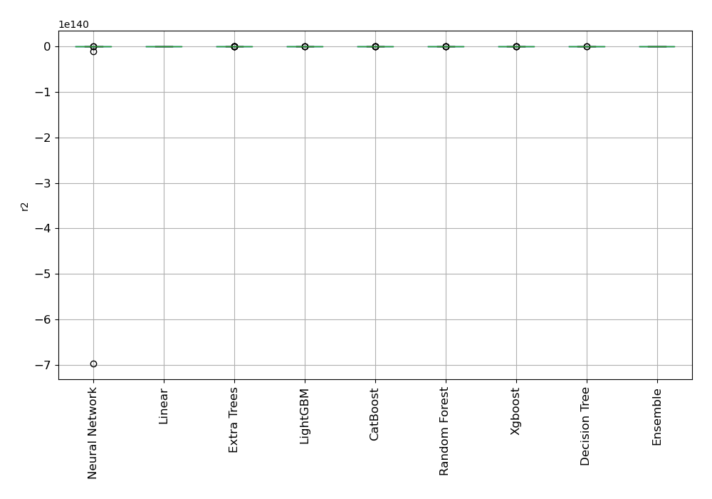

# AutoML Leaderboard

| Best model   | name                                                                     | model_type     | metric_type   |   metric_value |   train_time |
|:-------------|:-------------------------------------------------------------------------|:---------------|:--------------|---------------:|-------------:|
|              | [1_DecisionTree](1_DecisionTree/README.md)                               | Decision Tree  | r2            |   0.00694503   |         2.6  |
|              | [2_DecisionTree](2_DecisionTree/README.md)                               | Decision Tree  | r2            |   0.00694503   |         2.81 |
|              | [3_DecisionTree](3_DecisionTree/README.md)                               | Decision Tree  | r2            |   0.00694503   |         2.71 |
|              | [4_Linear](4_Linear/README.md)                                           | Linear         | r2            |  -0.0187195    |         3.5  |
|              | [5_Default_LightGBM](5_Default_LightGBM/README.md)                       | LightGBM       | r2            |  -0.0160574    |        10.51 |
|              | [6_Default_Xgboost](6_Default_Xgboost/README.md)                         | Xgboost        | r2            |  -0.0150498    |        32.98 |
|              | [7_Default_CatBoost](7_Default_CatBoost/README.md)                       | CatBoost       | r2            |  -0.0159062    |         6.73 |
|              | [8_Default_NeuralNetwork](8_Default_NeuralNetwork/README.md)             | Neural Network | r2            |  -0.0162371    |        13.84 |
|              | [9_Default_RandomForest](9_Default_RandomForest/README.md)               | Random Forest  | r2            |  -0.0155003    |         8.82 |
|              | [10_Default_ExtraTrees](10_Default_ExtraTrees/README.md)                 | Extra Trees    | r2            |  -0.0157085    |         7.54 |
|              | [20_LightGBM](20_LightGBM/README.md)                                     | LightGBM       | r2            |  -0.0160574    |        17.58 |
|              | [11_Xgboost](11_Xgboost/README.md)                                       | Xgboost        | r2            |  -0.0150531    |        32.86 |
|              | [29_CatBoost](29_CatBoost/README.md)                                     | CatBoost       | r2            |  -0.0158576    |         9.18 |
|              | [38_RandomForest](38_RandomForest/README.md)                             | Random Forest  | r2            |  -0.015357     |         9.23 |
|              | [47_ExtraTrees](47_ExtraTrees/README.md)                                 | Extra Trees    | r2            |  -0.0155604    |         8.6  |
|              | [56_NeuralNetwork](56_NeuralNetwork/README.md)                           | Neural Network | r2            |  -0.0181678    |         7.38 |
|              | [21_LightGBM](21_LightGBM/README.md)                                     | LightGBM       | r2            |  -0.016037     |         6.73 |
|              | [12_Xgboost](12_Xgboost/README.md)                                       | Xgboost        | r2            |  -0.0150384    |        25.34 |
|              | [30_CatBoost](30_CatBoost/README.md)                                     | CatBoost       | r2            |  -0.0149769    |         8.74 |
|              | [39_RandomForest](39_RandomForest/README.md)                             | Random Forest  | r2            |  -0.0153153    |         9    |
|              | [48_ExtraTrees](48_ExtraTrees/README.md)                                 | Extra Trees    | r2            |  -0.0163275    |         8.67 |
|              | [57_NeuralNetwork](57_NeuralNetwork/README.md)                           | Neural Network | r2            |  -0.0161038    |        14.47 |
|              | [22_LightGBM](22_LightGBM/README.md)                                     | LightGBM       | r2            |  -0.0160574    |        11.83 |
|              | [13_Xgboost](13_Xgboost/README.md)                                       | Xgboost        | r2            |  -0.0150831    |        23.82 |
|              | [31_CatBoost](31_CatBoost/README.md)                                     | CatBoost       | r2            |  -0.015937     |         8.24 |
|              | [40_RandomForest](40_RandomForest/README.md)                             | Random Forest  | r2            |  -0.0152682    |        10.44 |
|              | [49_ExtraTrees](49_ExtraTrees/README.md)                                 | Extra Trees    | r2            |  -0.0154887    |         8.24 |
|              | [58_NeuralNetwork](58_NeuralNetwork/README.md)                           | Neural Network | r2            |  -0.0189869    |        14.15 |
|              | [23_LightGBM](23_LightGBM/README.md)                                     | LightGBM       | r2            |  -0.0160574    |        12.57 |
|              | [14_Xgboost](14_Xgboost/README.md)                                       | Xgboost        | r2            |  -0.0149906    |        24.93 |
|              | [32_CatBoost](32_CatBoost/README.md)                                     | CatBoost       | r2            |  -0.0150096    |         8.6  |
|              | [41_RandomForest](41_RandomForest/README.md)                             | Random Forest  | r2            |  -0.0153416    |        13.64 |
|              | [50_ExtraTrees](50_ExtraTrees/README.md)                                 | Extra Trees    | r2            |  -0.0154887    |         8.94 |
|              | [59_NeuralNetwork](59_NeuralNetwork/README.md)                           | Neural Network | r2            |  -0.0162831    |        13.98 |
|              | [24_LightGBM](24_LightGBM/README.md)                                     | LightGBM       | r2            |  -0.016037     |         9.43 |
|              | [15_Xgboost](15_Xgboost/README.md)                                       | Xgboost        | r2            |  -0.0150385    |        37.18 |
|              | [33_CatBoost](33_CatBoost/README.md)                                     | CatBoost       | r2            |  -0.0151611    |         9.53 |
|              | [42_RandomForest](42_RandomForest/README.md)                             | Random Forest  | r2            |  -0.0155144    |        11.64 |
|              | [51_ExtraTrees](51_ExtraTrees/README.md)                                 | Extra Trees    | r2            |  -0.0154887    |        11.26 |
|              | [60_NeuralNetwork](60_NeuralNetwork/README.md)                           | Neural Network | r2            |  -0.01595      |        16.35 |
|              | [25_LightGBM](25_LightGBM/README.md)                                     | LightGBM       | r2            |  -0.0160574    |        17.79 |
|              | [16_Xgboost](16_Xgboost/README.md)                                       | Xgboost        | r2            |  -0.0150618    |        29.45 |
|              | [34_CatBoost](34_CatBoost/README.md)                                     | CatBoost       | r2            |  -0.0148322    |        11.93 |
|              | [43_RandomForest](43_RandomForest/README.md)                             | Random Forest  | r2            |  -0.0154747    |        12.89 |
|              | [52_ExtraTrees](52_ExtraTrees/README.md)                                 | Extra Trees    | r2            |  -0.0154887    |        10.73 |
|              | [61_NeuralNetwork](61_NeuralNetwork/README.md)                           | Neural Network | r2            |  -0.0174172    |        19.76 |
|              | [26_LightGBM](26_LightGBM/README.md)                                     | LightGBM       | r2            |  -0.0160574    |        16.87 |
|              | [17_Xgboost](17_Xgboost/README.md)                                       | Xgboost        | r2            |  -0.0150327    |        38.51 |
|              | [35_CatBoost](35_CatBoost/README.md)                                     | CatBoost       | r2            |  -0.0149759    |        15.04 |
|              | [44_RandomForest](44_RandomForest/README.md)                             | Random Forest  | r2            |  -0.0153586    |        13.78 |
|              | [53_ExtraTrees](53_ExtraTrees/README.md)                                 | Extra Trees    | r2            |  -0.0155286    |        13.53 |
|              | [62_NeuralNetwork](62_NeuralNetwork/README.md)                           | Neural Network | r2            |  -0.0160759    |        16.45 |
|              | [27_LightGBM](27_LightGBM/README.md)                                     | LightGBM       | r2            |  -0.016053     |        15.5  |
|              | [18_Xgboost](18_Xgboost/README.md)                                       | Xgboost        | r2            |  -0.0150416    |        33.34 |
|              | [36_CatBoost](36_CatBoost/README.md)                                     | CatBoost       | r2            |  -0.0150886    |        12.12 |
|              | [45_RandomForest](45_RandomForest/README.md)                             | Random Forest  | r2            |  -0.0154135    |        16.72 |
|              | [54_ExtraTrees](54_ExtraTrees/README.md)                                 | Extra Trees    | r2            |  -0.0155698    |        12.9  |
|              | [63_NeuralNetwork](63_NeuralNetwork/README.md)                           | Neural Network | r2            |  -0.0192668    |        19.39 |
|              | [28_LightGBM](28_LightGBM/README.md)                                     | LightGBM       | r2            |  -0.0160574    |        19.34 |
|              | [19_Xgboost](19_Xgboost/README.md)                                       | Xgboost        | r2            |  -0.0150313    |        47.53 |
|              | [37_CatBoost](37_CatBoost/README.md)                                     | CatBoost       | r2            |  -0.01592      |        21.02 |
|              | [46_RandomForest](46_RandomForest/README.md)                             | Random Forest  | r2            |  -0.0155719    |        16.67 |
|              | [55_ExtraTrees](55_ExtraTrees/README.md)                                 | Extra Trees    | r2            |  -0.0154887    |        14.46 |
|              | [64_NeuralNetwork](64_NeuralNetwork/README.md)                           | Neural Network | r2            |  -0.0173023    |        19    |
|              | [1_DecisionTree_KMeansFeatures](1_DecisionTree_KMeansFeatures/README.md) | Decision Tree  | r2            |   0.00694503   |        12.18 |
|              | [2_DecisionTree_KMeansFeatures](2_DecisionTree_KMeansFeatures/README.md) | Decision Tree  | r2            |   0.00694503   |        12.35 |
|              | [3_DecisionTree_KMeansFeatures](3_DecisionTree_KMeansFeatures/README.md) | Decision Tree  | r2            |   0.00694503   |        11.15 |
|              | [1_DecisionTree_RandomFeature](1_DecisionTree_RandomFeature/README.md)   | Decision Tree  | r2            |   0.0014771    |        53.54 |
|              | [65_DecisionTree](65_DecisionTree/README.md)                             | Decision Tree  | r2            |   0.00694503   |        13.34 |
|              | [66_DecisionTree](66_DecisionTree/README.md)                             | Decision Tree  | r2            |   0.00694503   |        12.37 |
|              | [67_DecisionTree](67_DecisionTree/README.md)                             | Decision Tree  | r2            |   0.00694503   |        12.55 |
|              | [68_CatBoost](68_CatBoost/README.md)                                     | CatBoost       | r2            |  -0.0147476    |        18.55 |
|              | [69_CatBoost](69_CatBoost/README.md)                                     | CatBoost       | r2            |  -0.0149759    |        18.67 |
|              | [70_CatBoost](70_CatBoost/README.md)                                     | CatBoost       | r2            |  -0.0149759    |        19.44 |
|              | [71_CatBoost](71_CatBoost/README.md)                                     | CatBoost       | r2            |  -0.0149769    |        17    |
|              | [72_CatBoost](72_CatBoost/README.md)                                     | CatBoost       | r2            |  -0.0149769    |        16.89 |
|              | [73_Xgboost](73_Xgboost/README.md)                                       | Xgboost        | r2            |  -0.0149906    |        30.62 |
|              | [74_Xgboost](74_Xgboost/README.md)                                       | Xgboost        | r2            |  -0.0149906    |        32.43 |
|              | [75_Xgboost](75_Xgboost/README.md)                                       | Xgboost        | r2            |  -0.0150313    |        40.96 |
|              | [76_Xgboost](76_Xgboost/README.md)                                       | Xgboost        | r2            |  -0.0150313    |        42.63 |
|              | [77_Xgboost](77_Xgboost/README.md)                                       | Xgboost        | r2            |  -0.0150327    |        47.33 |
|              | [78_Xgboost](78_Xgboost/README.md)                                       | Xgboost        | r2            |  -0.0150327    |        46.94 |
|              | [79_RandomForest](79_RandomForest/README.md)                             | Random Forest  | r2            |  -0.0152682    |        18.75 |
|              | [80_RandomForest](80_RandomForest/README.md)                             | Random Forest  | r2            |  -0.0153153    |        21.03 |
|              | [81_RandomForest](81_RandomForest/README.md)                             | Random Forest  | r2            |  -0.0153153    |        20.52 |
|              | [82_RandomForest](82_RandomForest/README.md)                             | Random Forest  | r2            |  -0.0153416    |        22.34 |
|              | [83_RandomForest](83_RandomForest/README.md)                             | Random Forest  | r2            |  -0.0153416    |        23.58 |
|              | [84_ExtraTrees](84_ExtraTrees/README.md)                                 | Extra Trees    | r2            |  -0.0154887    |        18.97 |
|              | [85_ExtraTrees](85_ExtraTrees/README.md)                                 | Extra Trees    | r2            |  -0.0154887    |        19.4  |
|              | [86_ExtraTrees](86_ExtraTrees/README.md)                                 | Extra Trees    | r2            |  -0.0154887    |        17.19 |
|              | [87_ExtraTrees](87_ExtraTrees/README.md)                                 | Extra Trees    | r2            |  -0.0154887    |        19.36 |
|              | [88_NeuralNetwork](88_NeuralNetwork/README.md)                           | Neural Network | r2            |  -0.0167108    |        37.6  |
|              | [89_NeuralNetwork](89_NeuralNetwork/README.md)                           | Neural Network | r2            |  -0.0167987    |        34.38 |
|              | [90_LightGBM](90_LightGBM/README.md)                                     | LightGBM       | r2            |  -0.016053     |        29.49 |
|              | [91_LightGBM](91_LightGBM/README.md)                                     | LightGBM       | r2            |  -0.016053     |        27.61 |
|              | [92_LightGBM](92_LightGBM/README.md)                                     | LightGBM       | r2            |  -0.0160574    |        29.85 |
|              | [93_LightGBM](93_LightGBM/README.md)                                     | LightGBM       | r2            |  -0.016037     |        25.11 |
|              | [94_NeuralNetwork](94_NeuralNetwork/README.md)                           | Neural Network | r2            |  -0.0158083    |        20.34 |
|              | [95_NeuralNetwork](95_NeuralNetwork/README.md)                           | Neural Network | r2            |  -0.0159909    |        25.42 |
|              | [96_NeuralNetwork](96_NeuralNetwork/README.md)                           | Neural Network | r2            |  -0.0164882    |        30.57 |
|              | [97_NeuralNetwork](97_NeuralNetwork/README.md)                           | Neural Network | r2            |  -0.0163508    |        32.24 |
|              | [98_DecisionTree](98_DecisionTree/README.md)                             | Decision Tree  | r2            |   0.00694503   |        18.69 |
|              | [99_DecisionTree](99_DecisionTree/README.md)                             | Decision Tree  | r2            |   0.00694503   |        19.83 |
|              | [100_CatBoost](100_CatBoost/README.md)                                   | CatBoost       | r2            |  -0.0147152    |        27.07 |
|              | [101_CatBoost](101_CatBoost/README.md)                                   | CatBoost       | r2            |  -0.0150006    |        31.01 |
|              | [102_Xgboost](102_Xgboost/README.md)                                     | Xgboost        | r2            |  -0.0150904    |        44.54 |
|              | [103_Xgboost](103_Xgboost/README.md)                                     | Xgboost        | r2            |  -0.0150904    |        48.77 |
|              | [104_Xgboost](104_Xgboost/README.md)                                     | Xgboost        | r2            |  -0.0150904    |        38.28 |
|              | [105_RandomForest](105_RandomForest/README.md)                           | Random Forest  | r2            |  -0.0152682    |        22.39 |
|              | [106_ExtraTrees](106_ExtraTrees/README.md)                               | Extra Trees    | r2            |  -0.0154887    |        23.62 |
|              | [107_NeuralNetwork](107_NeuralNetwork/README.md)                         | Neural Network | r2            |  -0.0169066    |        23.28 |
|              | [108_LightGBM](108_LightGBM/README.md)                                   | LightGBM       | r2            |  -0.016037     |        43.04 |
|              | [109_LightGBM](109_LightGBM/README.md)                                   | LightGBM       | r2            |  -0.016037     |        27.78 |
|              | [110_LightGBM](110_LightGBM/README.md)                                   | LightGBM       | r2            |  -0.016037     |        21.69 |
|              | [111_LightGBM](111_LightGBM/README.md)                                   | LightGBM       | r2            |  -0.016037     |        21.84 |
|              | [112_LightGBM](112_LightGBM/README.md)                                   | LightGBM       | r2            |  -0.016037     |        23.16 |
|              | [113_LightGBM](113_LightGBM/README.md)                                   | LightGBM       | r2            |  -0.016037     |        37.62 |
|              | [1_DecisionTree_BoostOnErrors](1_DecisionTree_BoostOnErrors/README.md)   | Decision Tree  | r2            |   0.00676332   |        17.23 |
| **the best** | [Ensemble](Ensemble/README.md)                                           | Ensemble       | r2            |   0.00700915   |        40.59 |
|              | [100_CatBoost_Stacked](100_CatBoost_Stacked/README.md)                   | CatBoost       | r2            |  -0.0155372    |        34.06 |
|              | [74_Xgboost_Stacked](74_Xgboost_Stacked/README.md)                       | Xgboost        | r2            |  -0.0147344    |        48.65 |
|              | [40_RandomForest_Stacked](40_RandomForest_Stacked/README.md)             | Random Forest  | r2            |  -0.0151314    |        37.87 |
|              | [86_ExtraTrees_Stacked](86_ExtraTrees_Stacked/README.md)                 | Extra Trees    | r2            |  -0.0150786    |        40.53 |
|              | [94_NeuralNetwork_Stacked](94_NeuralNetwork_Stacked/README.md)           | Neural Network | r2            |  -3.95327e+59  |        75.77 |
|              | [24_LightGBM_Stacked](24_LightGBM_Stacked/README.md)                     | LightGBM       | r2            |  -0.015401     |        61.61 |
|              | [68_CatBoost_Stacked](68_CatBoost_Stacked/README.md)                     | CatBoost       | r2            |  -0.0147933    |        29.93 |
|              | [73_Xgboost_Stacked](73_Xgboost_Stacked/README.md)                       | Xgboost        | r2            |  -0.0147468    |        72.32 |
|              | [105_RandomForest_Stacked](105_RandomForest_Stacked/README.md)           | Random Forest  | r2            |  -0.0147941    |        34.03 |
|              | [106_ExtraTrees_Stacked](106_ExtraTrees_Stacked/README.md)               | Extra Trees    | r2            |  -0.014905     |        36    |
|              | [60_NeuralNetwork_Stacked](60_NeuralNetwork_Stacked/README.md)           | Neural Network | r2            |  -6.97639e+140 |        69.76 |
|              | [111_LightGBM_Stacked](111_LightGBM_Stacked/README.md)                   | LightGBM       | r2            |  -0.015046     |        26.51 |
|              | [34_CatBoost_Stacked](34_CatBoost_Stacked/README.md)                     | CatBoost       | r2            |  -0.0151649    |        26.97 |
|              | [14_Xgboost_Stacked](14_Xgboost_Stacked/README.md)                       | Xgboost        | r2            |  -0.0147055    |        43.37 |
|              | [79_RandomForest_Stacked](79_RandomForest_Stacked/README.md)             | Random Forest  | r2            |  -0.0149481    |        39.6  |
|              | [51_ExtraTrees_Stacked](51_ExtraTrees_Stacked/README.md)                 | Extra Trees    | r2            |  -0.0143614    |        35.7  |
|              | [95_NeuralNetwork_Stacked](95_NeuralNetwork_Stacked/README.md)           | Neural Network | r2            |  -1.62757e+28  |        48.74 |
|              | [93_LightGBM_Stacked](93_LightGBM_Stacked/README.md)                     | LightGBM       | r2            |  -0.0148996    |        28.77 |
|              | [70_CatBoost_Stacked](70_CatBoost_Stacked/README.md)                     | CatBoost       | r2            |  -0.0151267    |        87.15 |
|              | [19_Xgboost_Stacked](19_Xgboost_Stacked/README.md)                       | Xgboost        | r2            |  -0.0148168    |        62.11 |
|              | [80_RandomForest_Stacked](80_RandomForest_Stacked/README.md)             | Random Forest  | r2            |  -0.0148062    |        29.99 |
|              | [87_ExtraTrees_Stacked](87_ExtraTrees_Stacked/README.md)                 | Extra Trees    | r2            |  -0.0145659    |        35.78 |
|              | [62_NeuralNetwork_Stacked](62_NeuralNetwork_Stacked/README.md)           | Neural Network | r2            |  -1.10144e+139 |        61.7  |

### AutoML Performance

### AutoML Performance Boxplot
