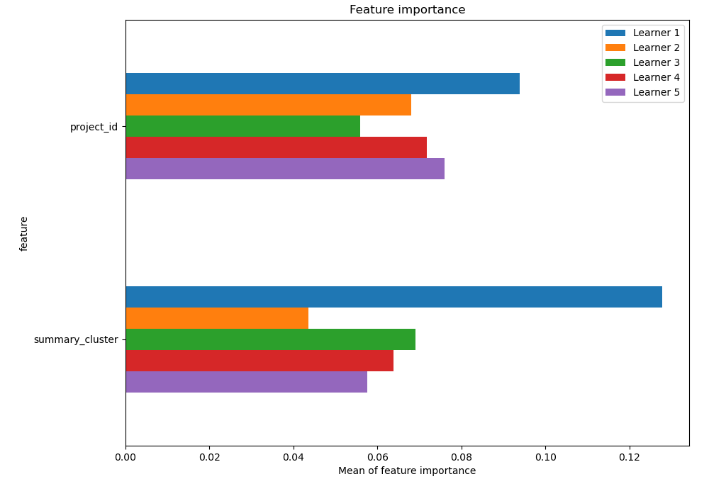
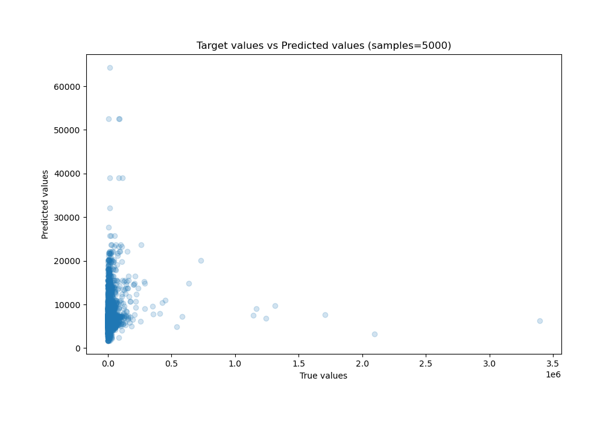
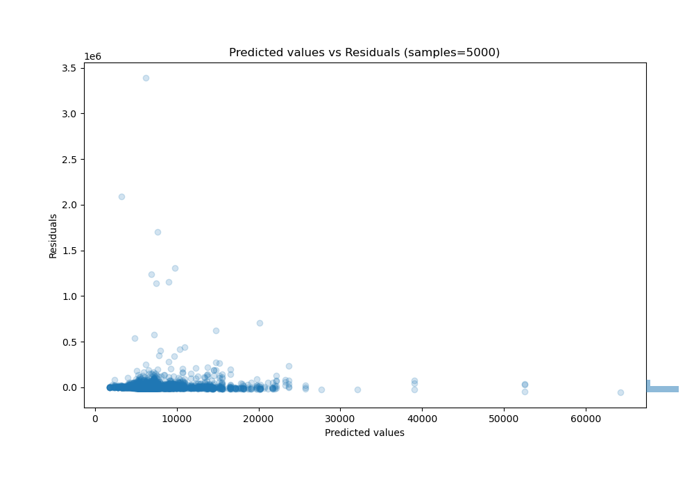

# Summary of 18_CatBoost

[<< Go back](../README.md)

## CatBoost
- **n_jobs**: -1
- **learning_rate**: 0.1
- **depth**: 4
- **rsm**: 0.9
- **loss_function**: MAPE
- **eval_metric**: R2
- **explain_level**: 2

## Validation
 - **validation_type**: kfold
 - **k_folds**: 5
 - **shuffle**: True

## Optimized metric
r2

## Training time

11.1 seconds

### Metric details:
| Metric   |           Score |
|:---------|----------------:|
| MAE      | 13192.6         |
| MSE      |     5.01892e+09 |
| RMSE     | 70844.3         |
| R2       |    -0.0106606   |
| MAPE     |     1.60855     |

## Learning curves

## Permutation-based Importance

## True vs Predicted

## Predicted vs Residuals

[<< Go back](../README.md)
