# Summary of 1_Linear

[<< Go back](../README.md)

## Linear Regression (Linear)
- **n_jobs**: -1
- **explain_level**: 2

## Validation
 - **validation_type**: kfold
 - **k_folds**: 5
 - **shuffle**: True

## Optimized metric
r2

## Training time

16.3 seconds

### Metric details:
| Metric   |           Score |
|:---------|----------------:|
| MAE      | 13377.8         |
| MSE      |     5.05886e+09 |
| RMSE     | 71125.7         |
| R2       |    -0.018704    |
| MAPE     |     1.60688     |

## Learning curves
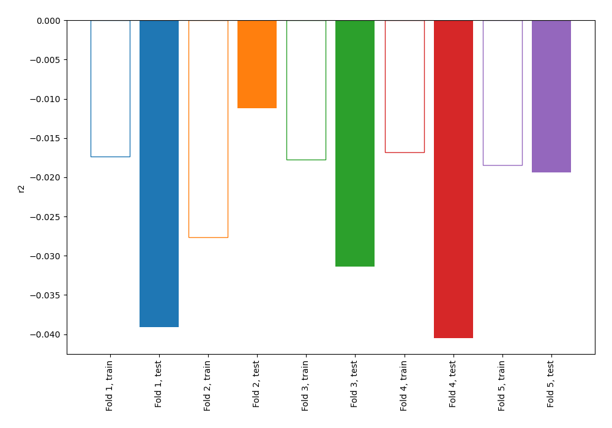

## Coefficients
| feature         |    Learner_1 |    Learner_2 |    Learner_3 |    Learner_4 |    Learner_5 |
|:----------------|-------------:|-------------:|-------------:|-------------:|-------------:|
| project_id      |  0.0713862   |  0.0800509   |  0.0794303   |  0.0797313   |  0.0774825   |
| intercept       | -6.36546e-16 |  5.79046e-16 | -5.50771e-16 | -6.34036e-16 | -4.49764e-17 |
| summary_cluster | -0.0312359   | -0.0294981   | -0.0214969   | -0.0271874   | -0.0268356   |

## Permutation-based Importance
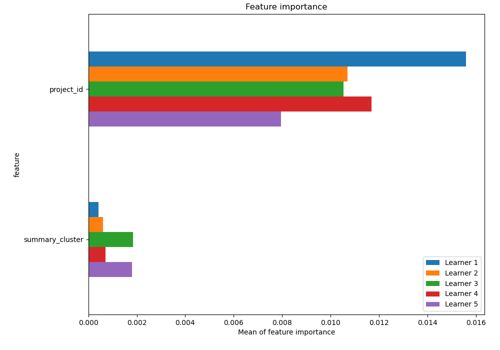
## True vs Predicted

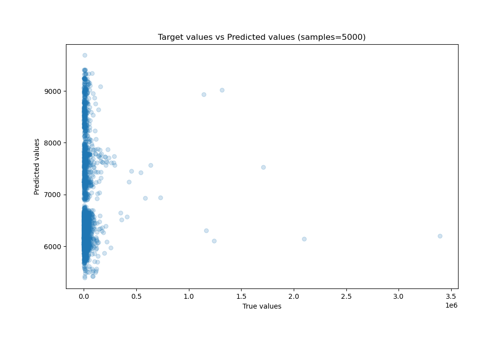

## Predicted vs Residuals

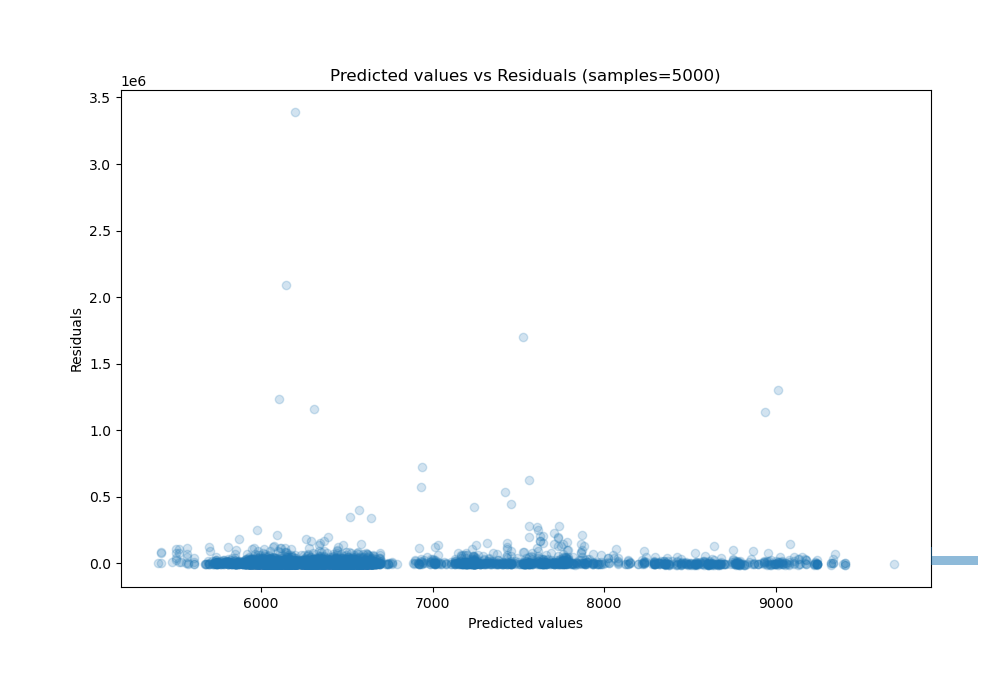

## SHAP Importance
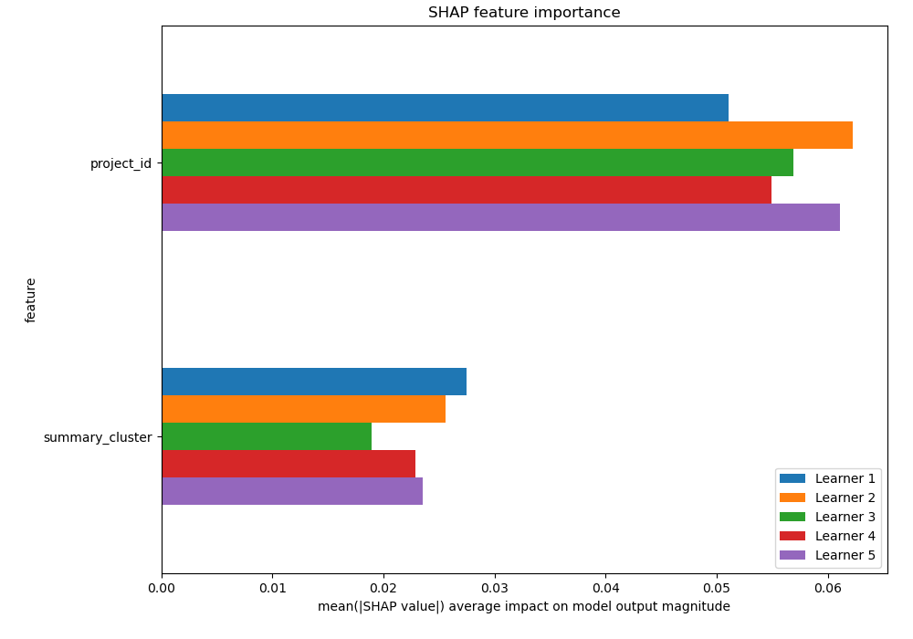

## SHAP Dependence plots

### Dependence (Fold 1)
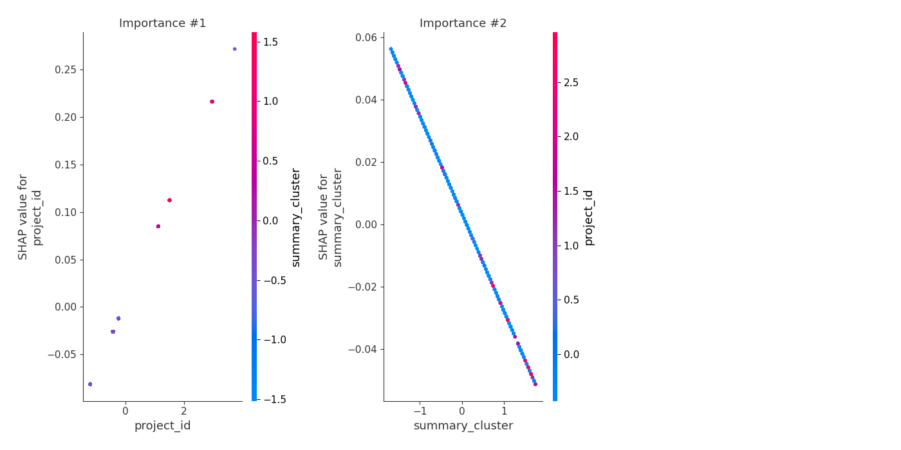
### Dependence (Fold 2)
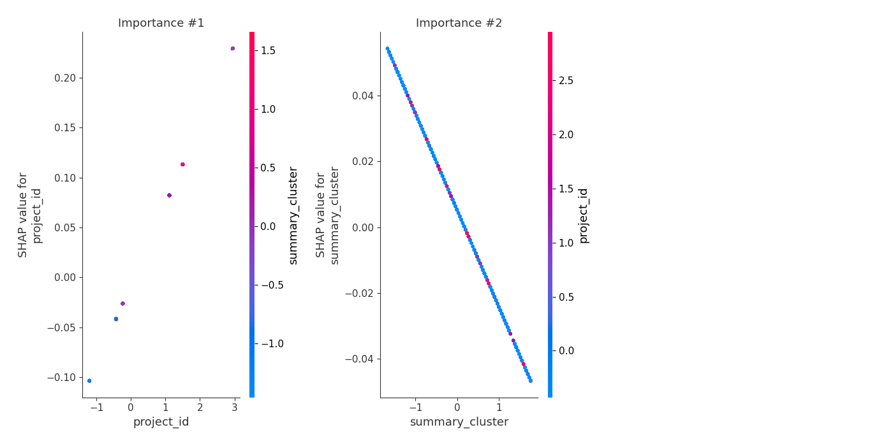
### Dependence (Fold 3)
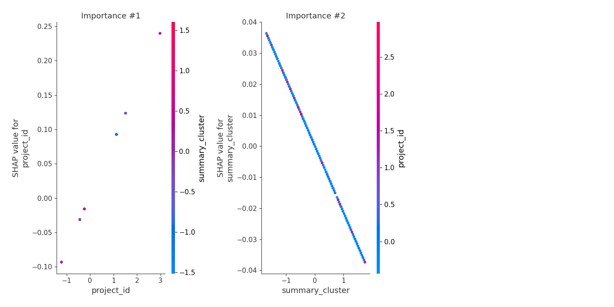
### Dependence (Fold 4)
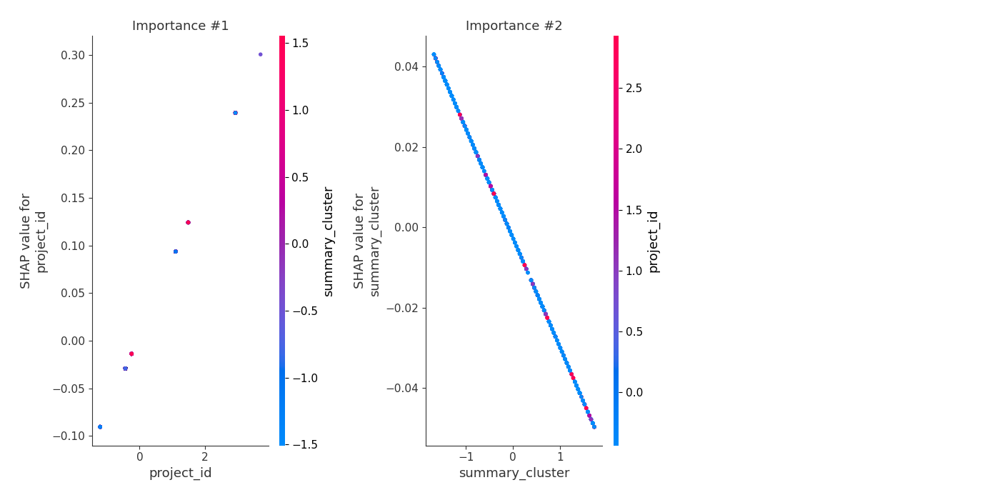
### Dependence (Fold 5)
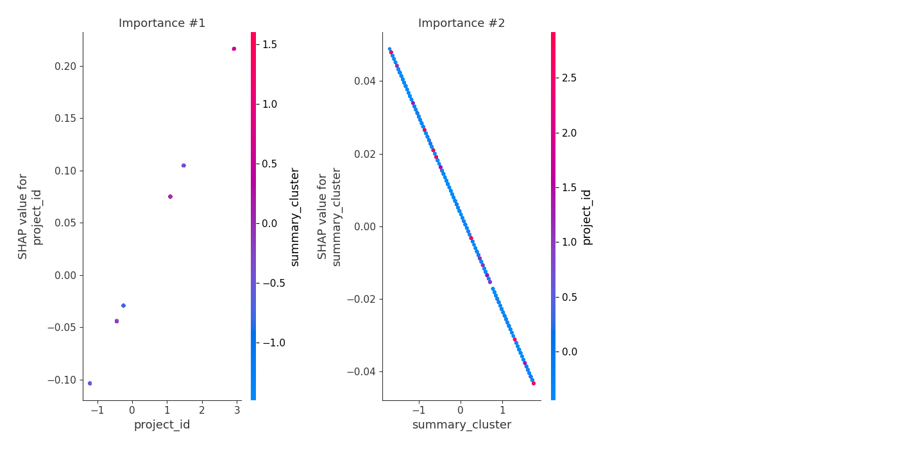

## SHAP Decision plots

### Top-10 Worst decisions (Fold 1)
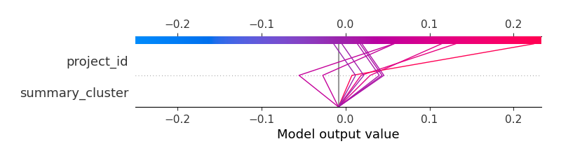
### Top-10 Worst decisions (Fold 2)
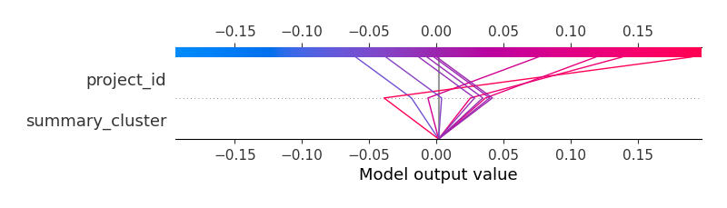
### Top-10 Worst decisions (Fold 3)
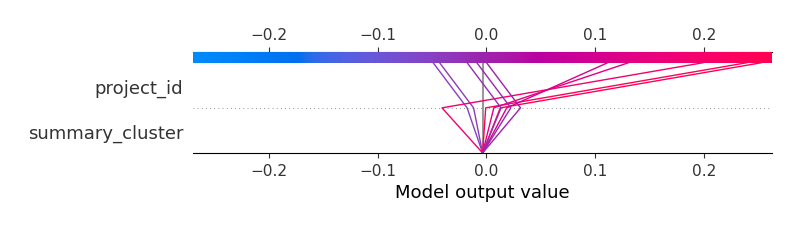
### Top-10 Worst decisions (Fold 4)

### Top-10 Worst decisions (Fold 5)
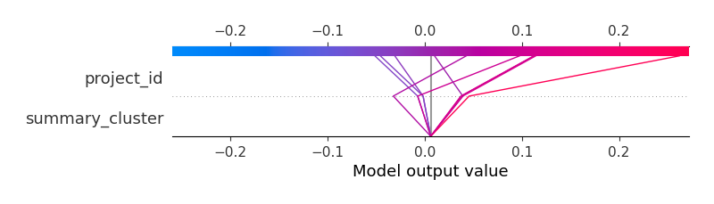
### Top-10 Best decisions (Fold 1)
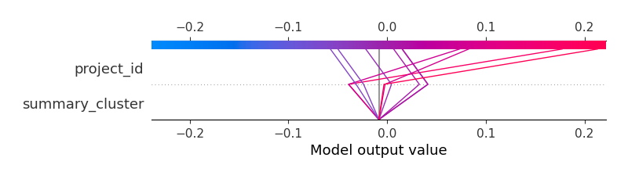
### Top-10 Best decisions (Fold 2)
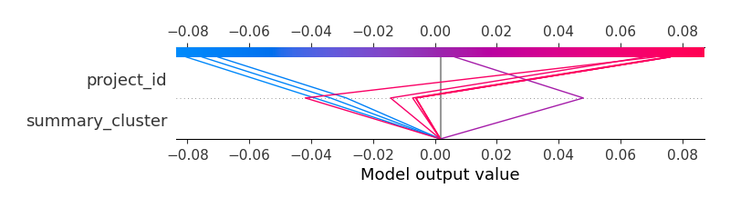
### Top-10 Best decisions (Fold 3)
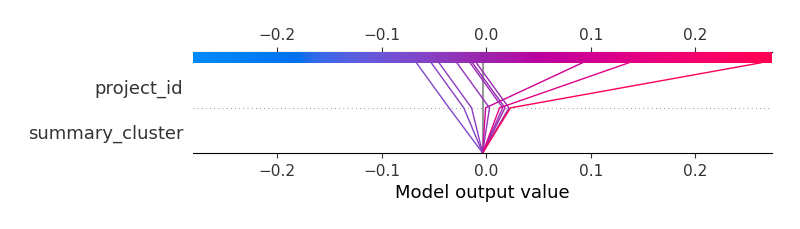
### Top-10 Best decisions (Fold 4)
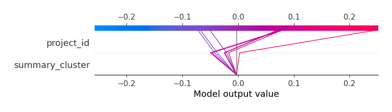
### Top-10 Best decisions (Fold 5)
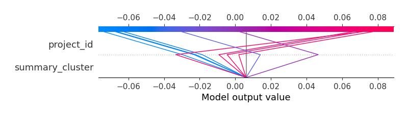

[<< Go back](../README.md)
