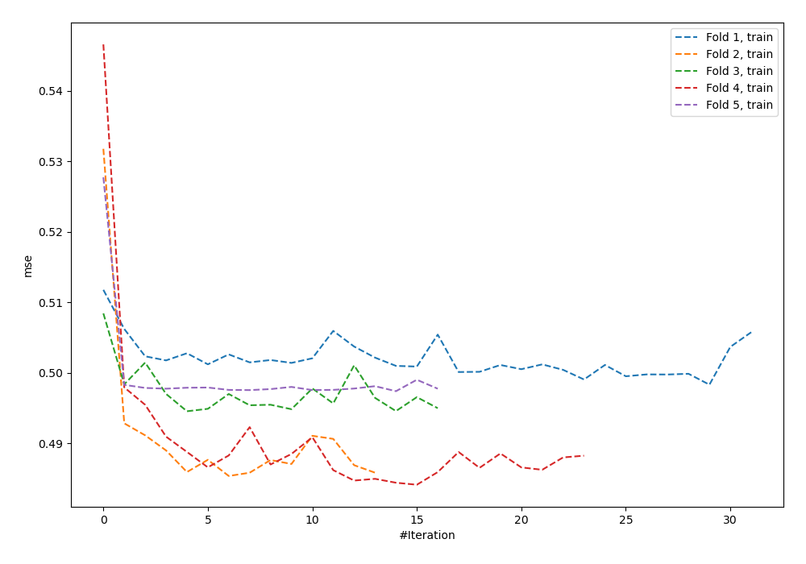
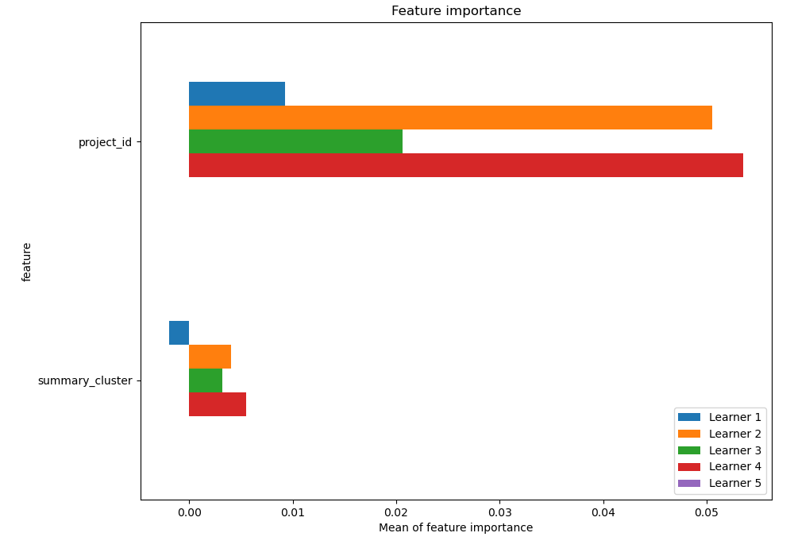
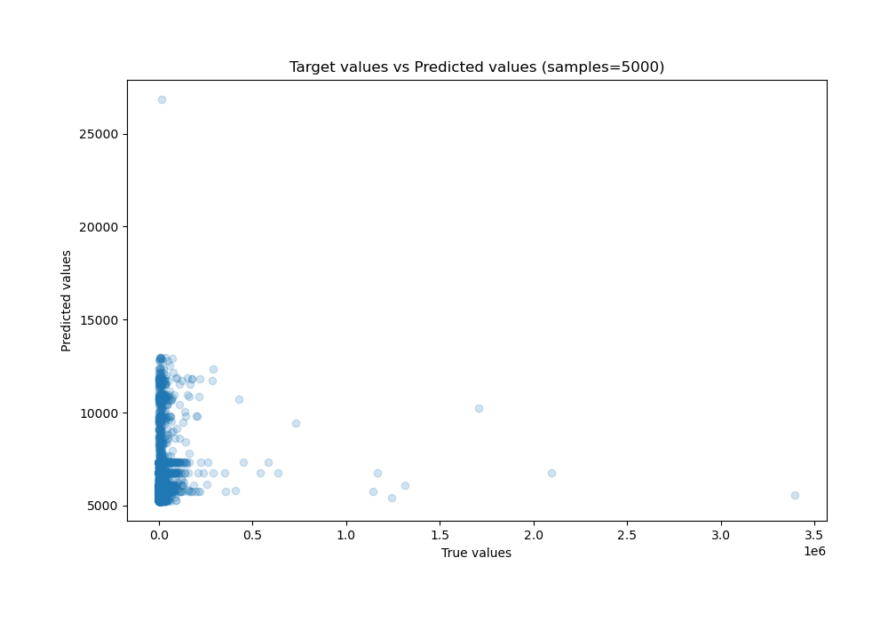
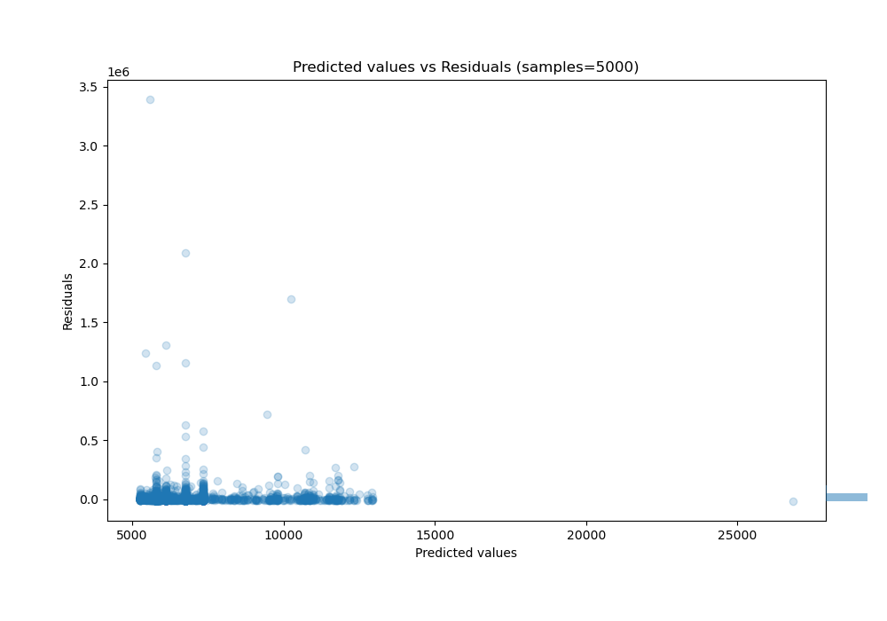

# Summary of 24_NeuralNetwork

[<< Go back](../README.md)

## Neural Network
- **n_jobs**: -1
- **dense_1_size**: 64
- **dense_2_size**: 4
- **learning_rate**: 0.05
- **explain_level**: 2

## Validation
 - **validation_type**: kfold
 - **k_folds**: 5
 - **shuffle**: True

## Optimized metric
r2

## Training time

6.8 seconds

### Metric details:
| Metric   |           Score |
|:---------|----------------:|
| MAE      | 13365.7         |
| MSE      |     5.05575e+09 |
| RMSE     | 71103.8         |
| R2       |    -0.0180773   |
| MAPE     |     1.58606     |

## Learning curves

## Permutation-based Importance

## True vs Predicted

## Predicted vs Residuals

[<< Go back](../README.md)
