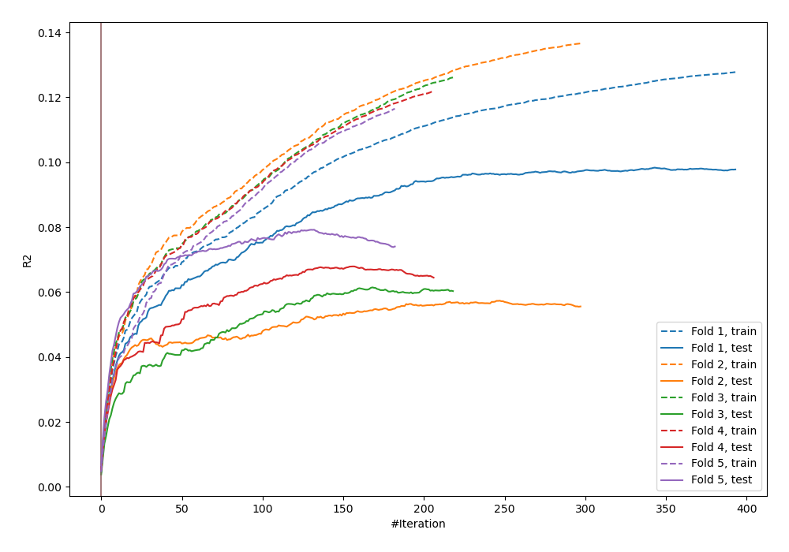
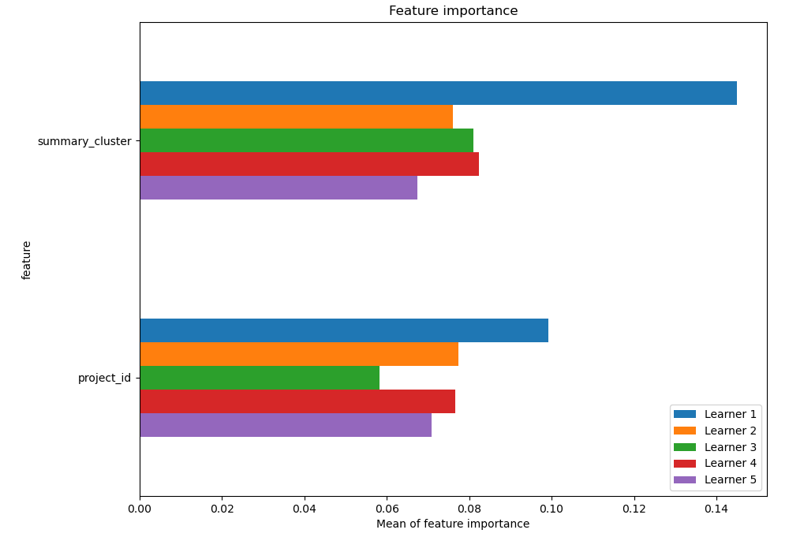
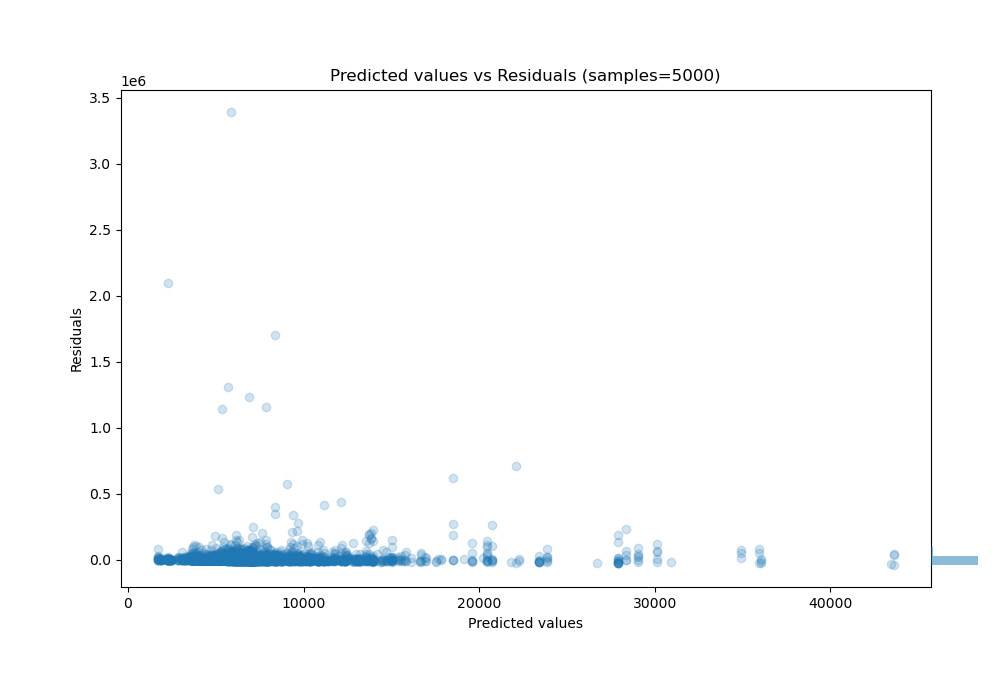

# Summary of 4_Default_CatBoost

[<< Go back](../README.md)

## CatBoost
- **n_jobs**: -1
- **learning_rate**: 0.1
- **depth**: 6
- **rsm**: 1
- **loss_function**: RMSE
- **eval_metric**: R2
- **explain_level**: 2

## Validation
 - **validation_type**: kfold
 - **k_folds**: 5
 - **shuffle**: True

## Optimized metric
r2

## Training time

4.5 seconds

### Metric details:
| Metric   |           Score |
|:---------|----------------:|
| MAE      | 13144.7         |
| MSE      |     5.01415e+09 |
| RMSE     | 70810.6         |
| R2       |    -0.00969956  |
| MAPE     |     1.5072      |

## Learning curves

## Permutation-based Importance

## True vs Predicted

## Predicted vs Residuals

[<< Go back](../README.md)
