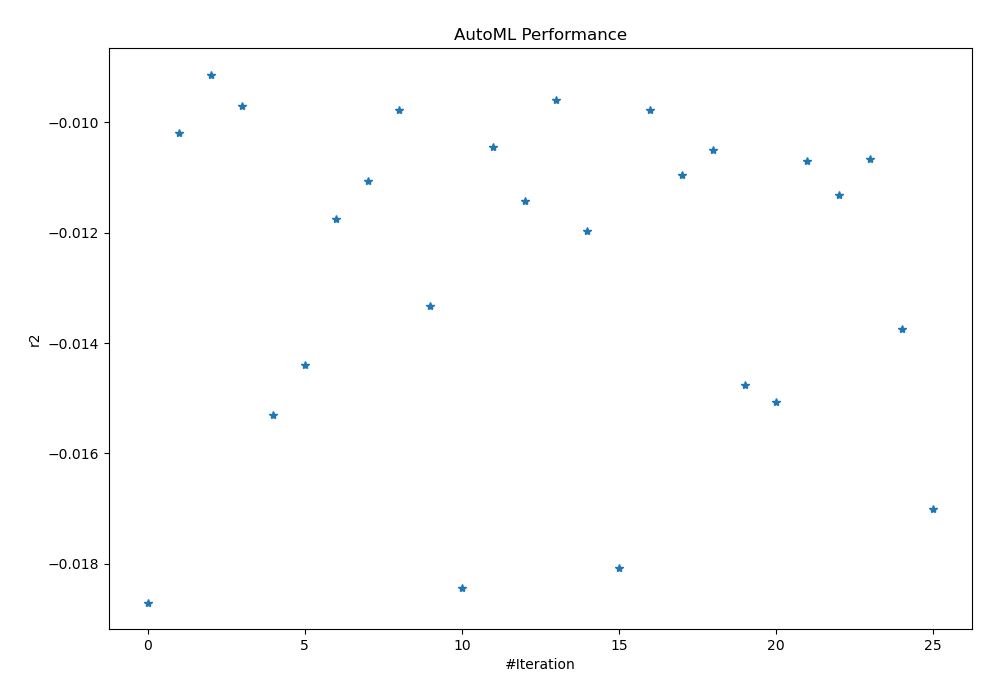

# AutoML Leaderboard

| Best model   | name                                                         | model_type     | metric_type   |   metric_value |   train_time |   single_prediction_time |
|:-------------|:-------------------------------------------------------------|:---------------|:--------------|---------------:|-------------:|-------------------------:|
|              | [1_Linear](1_Linear/README.md)                               | Linear         | r2            |    -0.018704   |        17.3  |                   0.0698 |
|              | [2_Default_LightGBM](2_Default_LightGBM/README.md)           | LightGBM       | r2            |    -0.0101959  |        12.79 |                   0.0496 |
| **the best** | [3_Default_Xgboost](3_Default_Xgboost/README.md)             | Xgboost        | r2            |    -0.00913056 |        23.65 |                   0.0704 |
|              | [4_Default_CatBoost](4_Default_CatBoost/README.md)           | CatBoost       | r2            |    -0.00969956 |         5.4  |                   0.0681 |
|              | [5_Default_NeuralNetwork](5_Default_NeuralNetwork/README.md) | Neural Network | r2            |    -0.0153117  |         6.57 |                   0.066  |
|              | [6_Default_RandomForest](6_Default_RandomForest/README.md)   | Random Forest  | r2            |    -0.0143997  |        16.97 |                   0.1086 |
|              | [11_LightGBM](11_LightGBM/README.md)                         | LightGBM       | r2            |    -0.0117427  |        27.81 |                   0.051  |
|              | [7_Xgboost](7_Xgboost/README.md)                             | Xgboost        | r2            |    -0.0110645  |        43.99 |                   0.0694 |
|              | [15_CatBoost](15_CatBoost/README.md)                         | CatBoost       | r2            |    -0.00977661 |         6.44 |                   0.0516 |
|              | [19_RandomForest](19_RandomForest/README.md)                 | Random Forest  | r2            |    -0.0133217  |        13.89 |                   0.0991 |
|              | [23_NeuralNetwork](23_NeuralNetwork/README.md)               | Neural Network | r2            |    -0.0184414  |         6.34 |                   0.0663 |
|              | [12_LightGBM](12_LightGBM/README.md)                         | LightGBM       | r2            |    -0.0104369  |        13.36 |                   0.0483 |
|              | [8_Xgboost](8_Xgboost/README.md)                             | Xgboost        | r2            |    -0.0114213  |        25.02 |                   0.0687 |
|              | [16_CatBoost](16_CatBoost/README.md)                         | CatBoost       | r2            |    -0.00958406 |         6.71 |                   0.0507 |
|              | [20_RandomForest](20_RandomForest/README.md)                 | Random Forest  | r2            |    -0.0119761  |        16.09 |                   0.0922 |
|              | [24_NeuralNetwork](24_NeuralNetwork/README.md)               | Neural Network | r2            |    -0.0180773  |         7.65 |                   0.0667 |
|              | [13_LightGBM](13_LightGBM/README.md)                         | LightGBM       | r2            |    -0.00976559 |        17.59 |                   0.049  |
|              | [9_Xgboost](9_Xgboost/README.md)                             | Xgboost        | r2            |    -0.0109452  |        24.93 |                   0.0703 |
|              | [17_CatBoost](17_CatBoost/README.md)                         | CatBoost       | r2            |    -0.0105076  |        13.8  |                   0.0523 |
|              | [21_RandomForest](21_RandomForest/README.md)                 | Random Forest  | r2            |    -0.0147601  |        15.41 |                   0.0933 |
|              | [25_NeuralNetwork](25_NeuralNetwork/README.md)               | Neural Network | r2            |    -0.0150648  |         9.22 |                   0.0692 |
|              | [14_LightGBM](14_LightGBM/README.md)                         | LightGBM       | r2            |    -0.0106961  |        18.33 |                   0.0488 |
|              | [10_Xgboost](10_Xgboost/README.md)                           | Xgboost        | r2            |    -0.0113183  |        37.72 |                   0.0855 |
|              | [18_CatBoost](18_CatBoost/README.md)                         | CatBoost       | r2            |    -0.0106606  |        12.28 |                   0.091  |
|              | [22_RandomForest](22_RandomForest/README.md)                 | Random Forest  | r2            |    -0.013745   |        19.27 |                   0.0881 |
|              | [26_NeuralNetwork](26_NeuralNetwork/README.md)               | Neural Network | r2            |    -0.0170041  |         9.17 |                   0.0715 |

### AutoML Performance

### AutoML Performance Boxplot
