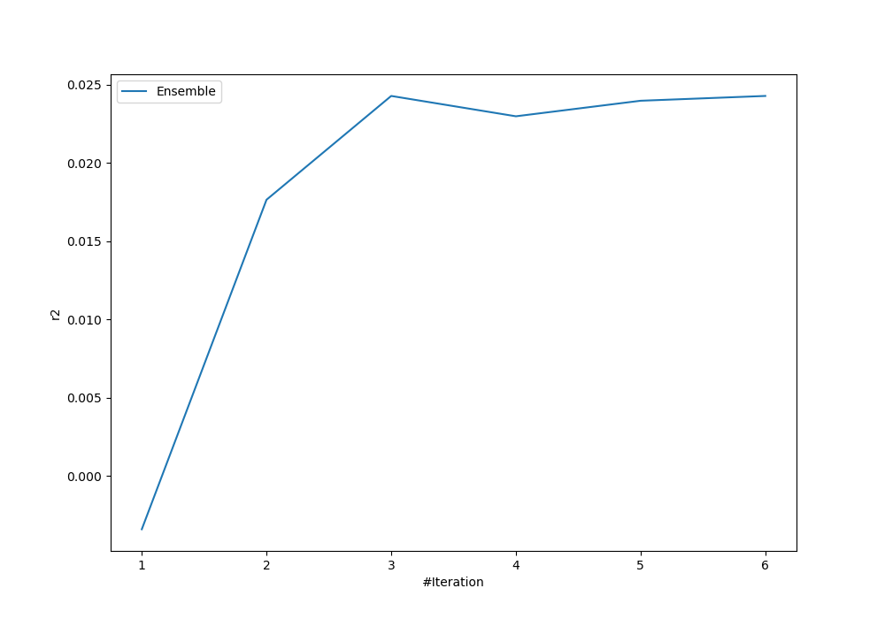
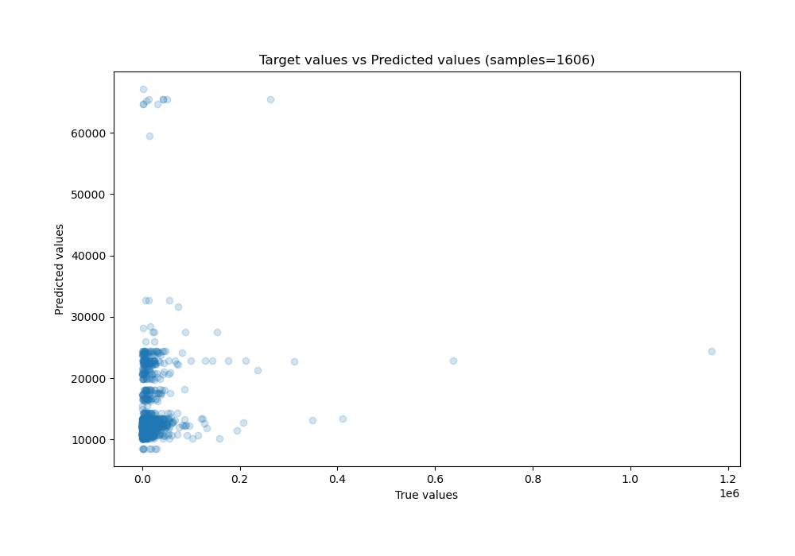

# Summary of Ensemble

[<< Go back](../README.md)

## Ensemble structure
| Model             |   Weight |
|:------------------|---------:|
| 1_Baseline        |        1 |
| 2_DecisionTree    |        1 |
| 4_Default_Xgboost |        1 |

### Metric details:
| Metric   |           Score |
|:---------|----------------:|
| MAE      | 13266.3         |
| MSE      |     1.68417e+09 |
| RMSE     | 41038.6         |
| R2       |     0.0242705   |
| MAPE     |     3.84398     |

## Learning curves

## True vs Predicted

## Predicted vs Residuals

[<< Go back](../README.md)
