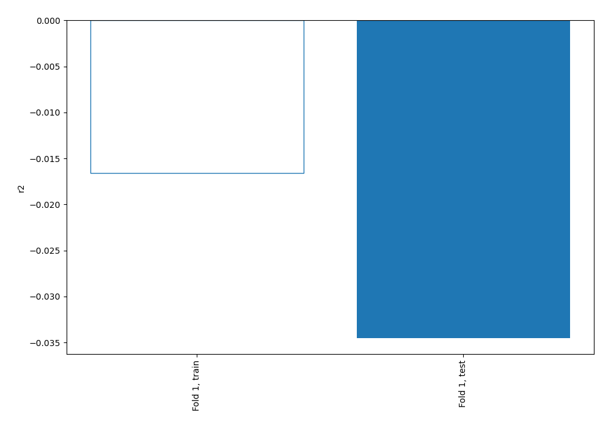
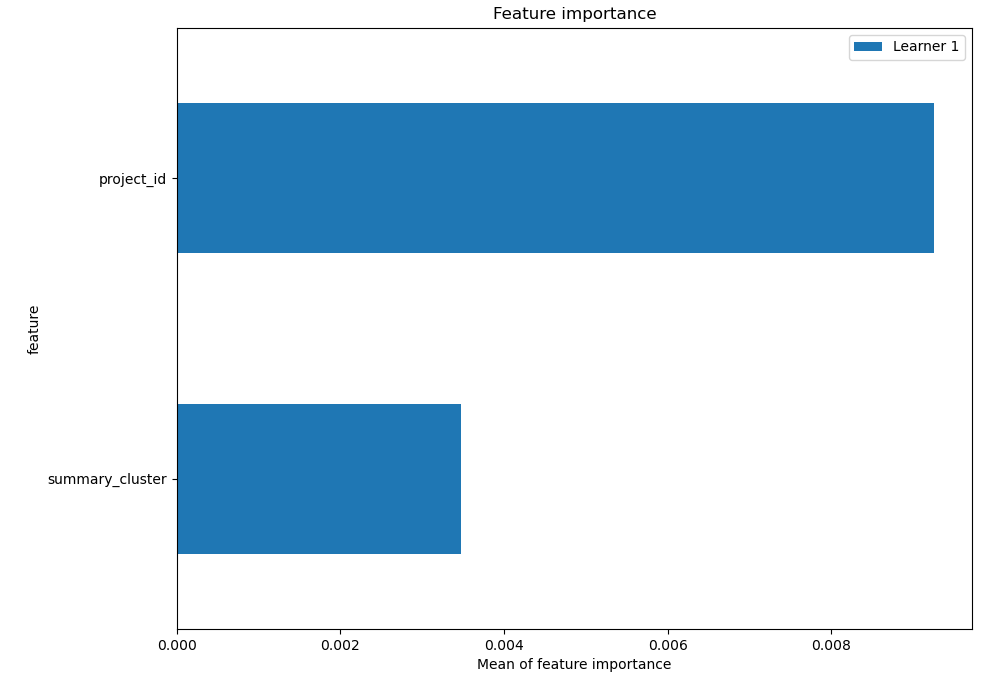
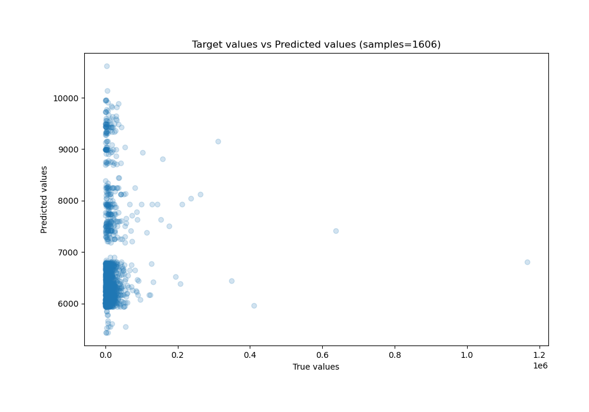
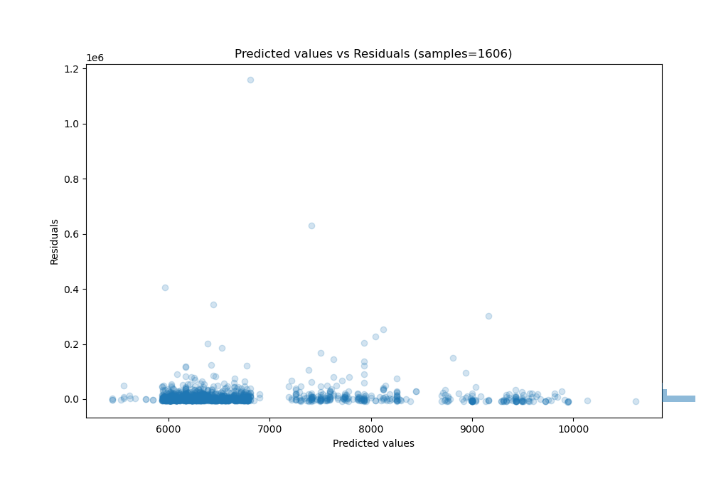
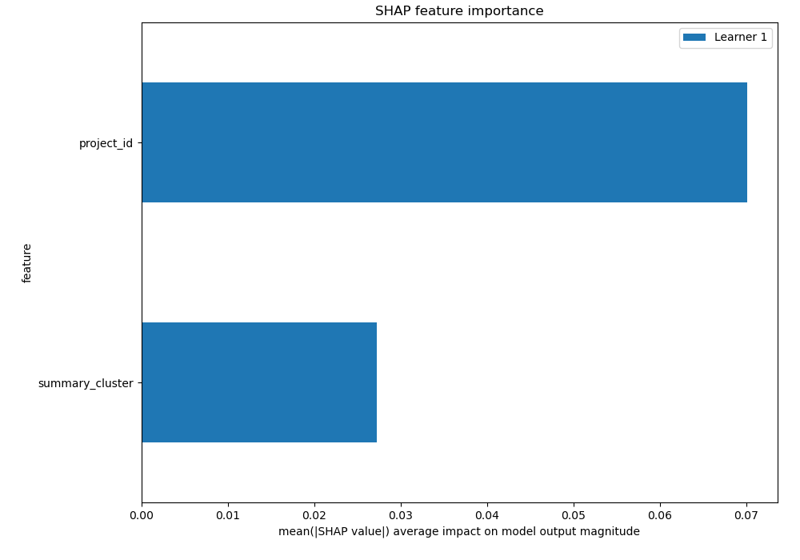
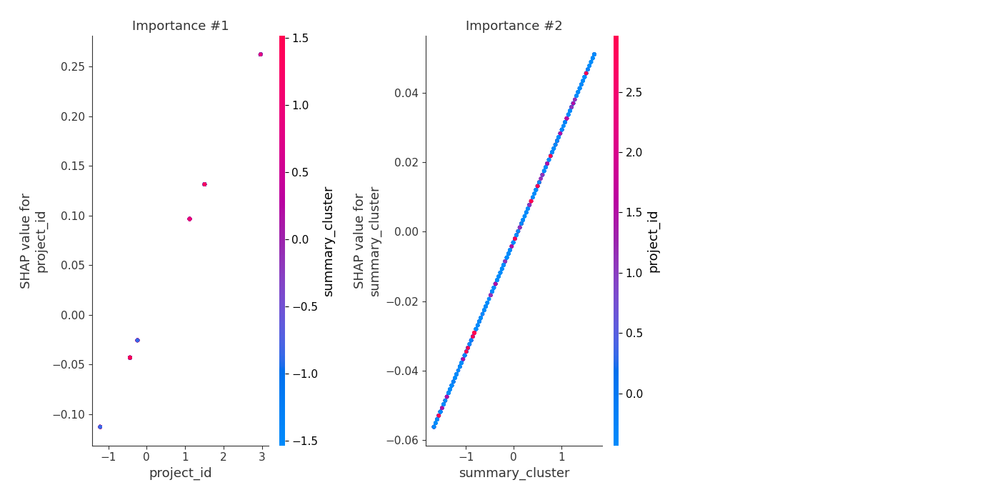
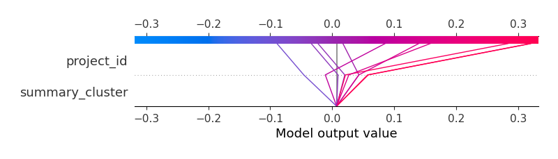
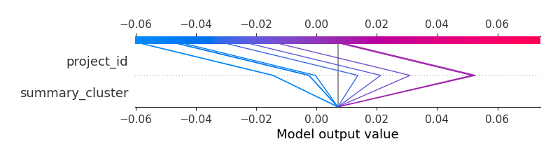

# Summary of 3_Linear

[<< Go back](../README.md)

## Linear Regression (Linear)
- **n_jobs**: -1
- **explain_level**: 2

## Validation
 - **validation_type**: split
 - **train_ratio**: 0.75
 - **shuffle**: True

## Optimized metric
r2

## Training time

5.4 seconds

### Metric details:
| Metric   |           Score |
|:---------|----------------:|
| MAE      | 11716.9         |
| MSE      |     1.78568e+09 |
| RMSE     | 42257.4         |
| R2       |    -0.0345433   |
| MAPE     |     1.8759      |

## Learning curves

## Coefficients
| feature         |    Learner_1 |
|:----------------|-------------:|
| project_id      |  0.0898206   |
| summary_cluster |  0.0319431   |
| intercept       | -7.85103e-16 |

## Permutation-based Importance

## True vs Predicted

## Predicted vs Residuals

## SHAP Importance

## SHAP Dependence plots

### Dependence (Fold 1)

## SHAP Decision plots

### Top-10 Worst decisions (Fold 1)

### Top-10 Best decisions (Fold 1)

[<< Go back](../README.md)
