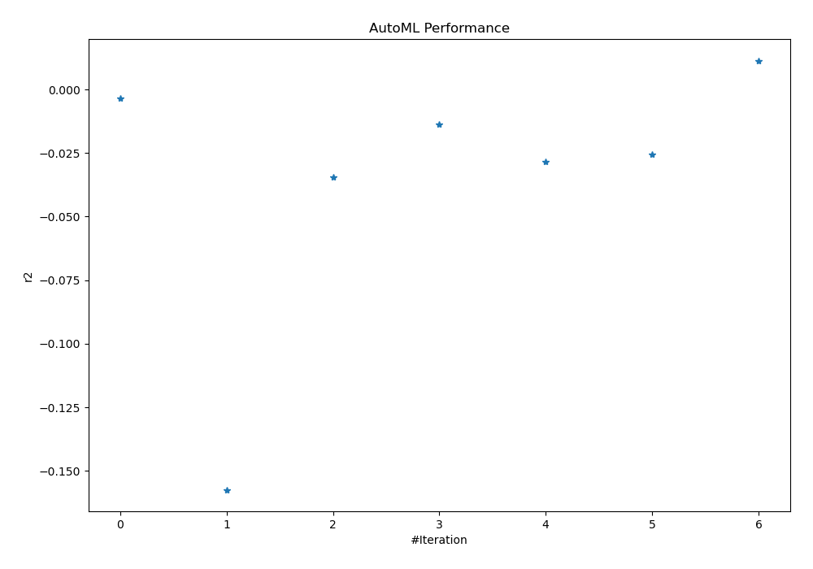
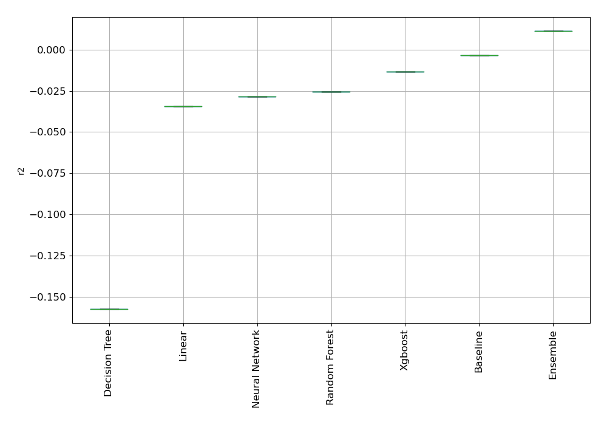
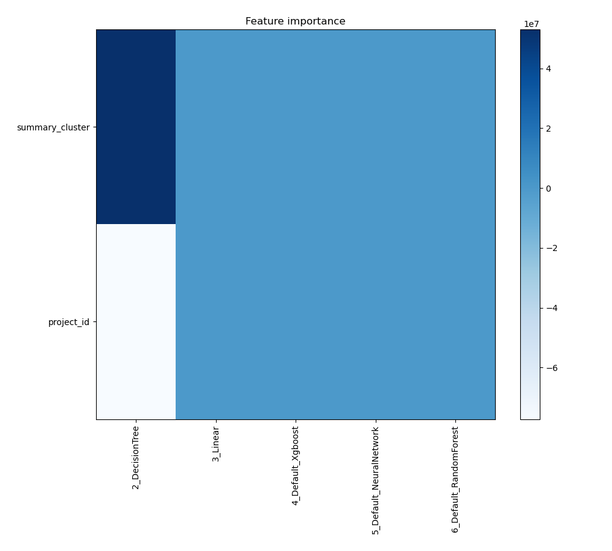
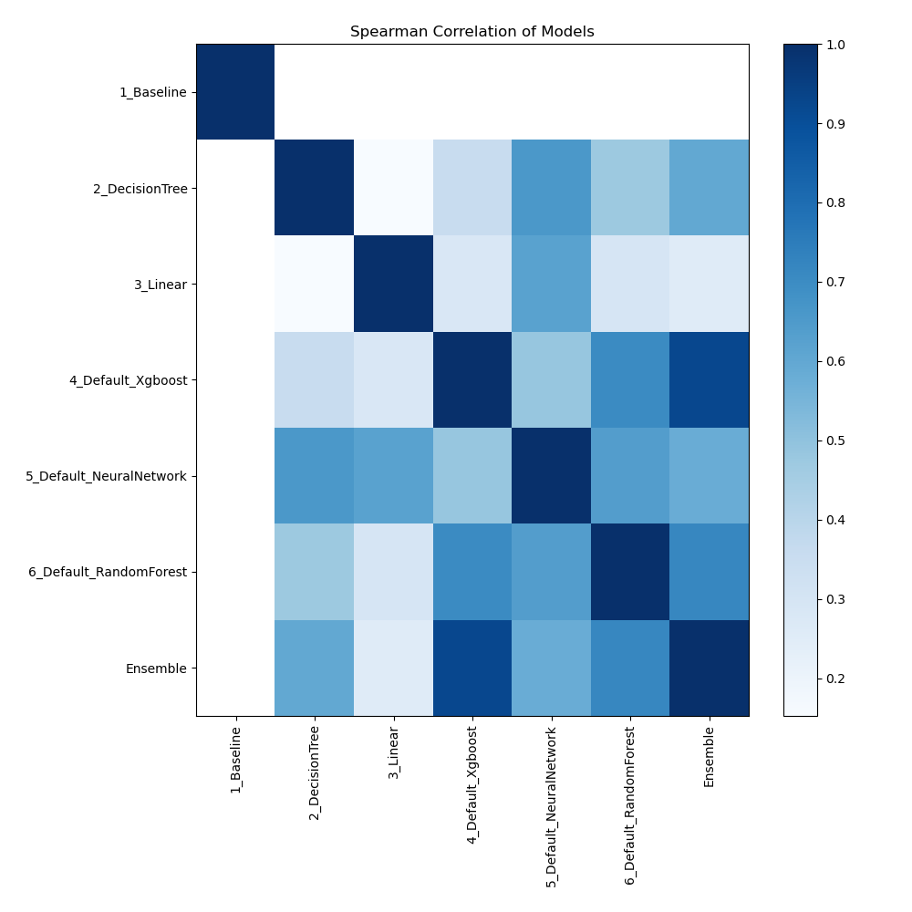

# AutoML Leaderboard

| Best model   | name                                                         | model_type     | metric_type   |   metric_value |   train_time |
|:-------------|:-------------------------------------------------------------|:---------------|:--------------|---------------:|-------------:|
|              | [1_Baseline](1_Baseline/README.md)                           | Baseline       | r2            |    -0.00339604 |         1.64 |
|              | [2_DecisionTree](2_DecisionTree/README.md)                   | Decision Tree  | r2            |    -0.157377   |        15.44 |
|              | [3_Linear](3_Linear/README.md)                               | Linear         | r2            |    -0.0345433  |         6.37 |
|              | [4_Default_Xgboost](4_Default_Xgboost/README.md)             | Xgboost        | r2            |    -0.0135789  |         9.46 |
|              | [5_Default_NeuralNetwork](5_Default_NeuralNetwork/README.md) | Neural Network | r2            |    -0.0283428  |         2.25 |
|              | [6_Default_RandomForest](6_Default_RandomForest/README.md)   | Random Forest  | r2            |    -0.0255077  |         4.43 |
| **the best** | [Ensemble](Ensemble/README.md)                               | Ensemble       | r2            |     0.0113439  |         0.67 |

### AutoML Performance

### AutoML Performance Boxplot

### Features Importance

### Spearman Correlation of Models

