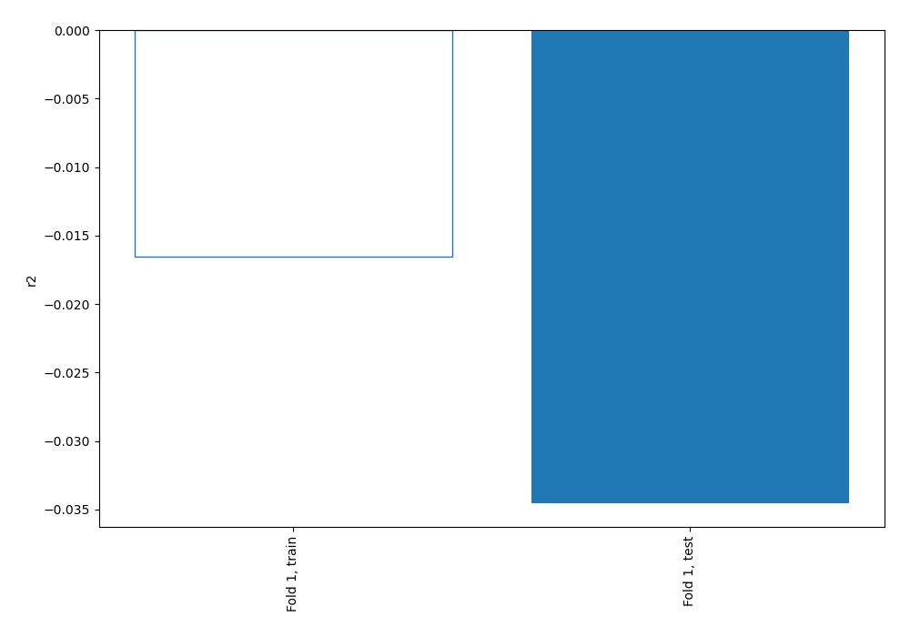
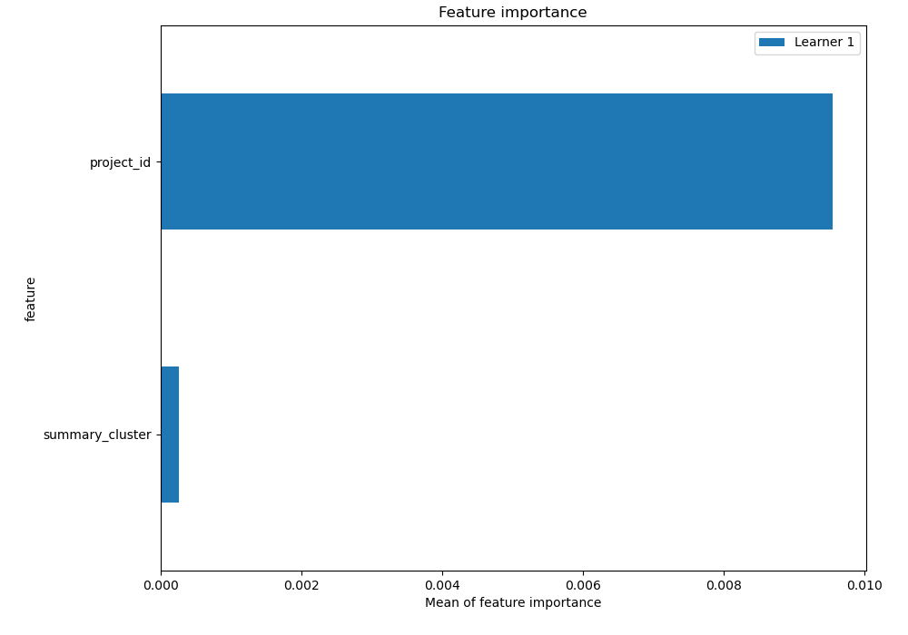
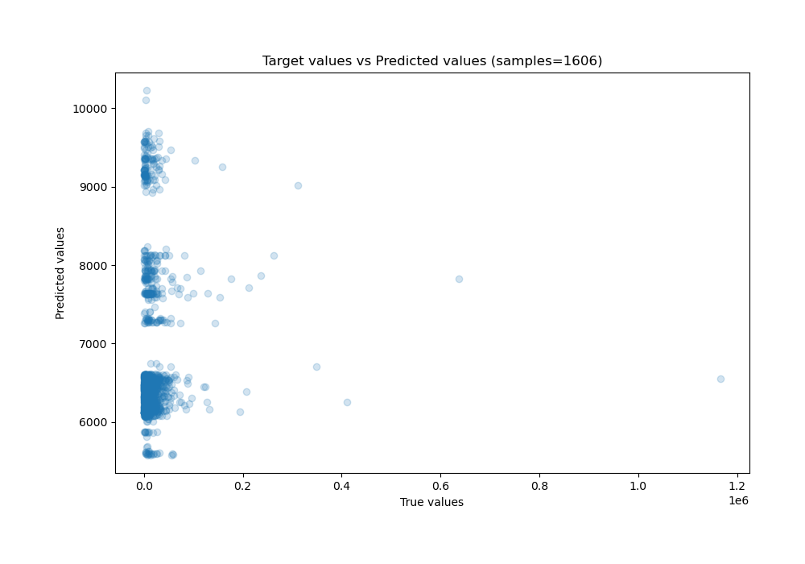
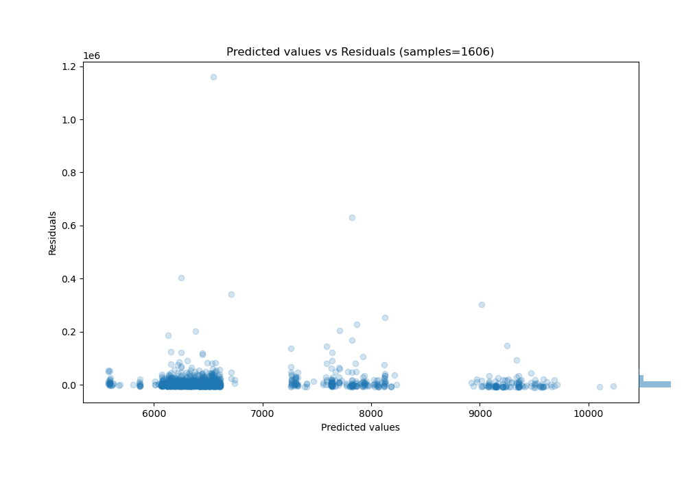
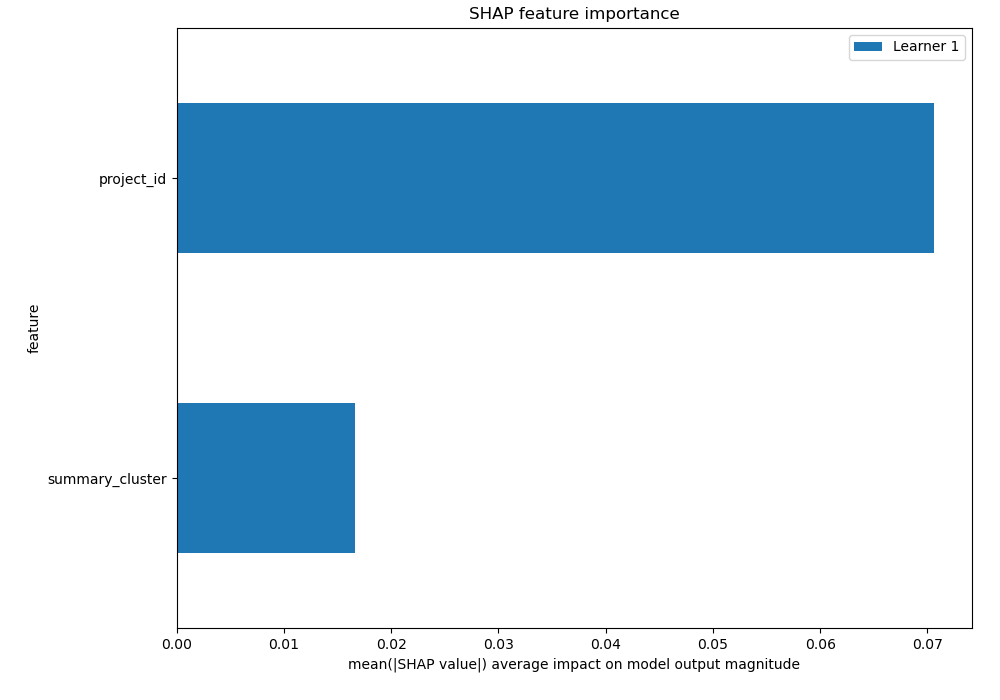
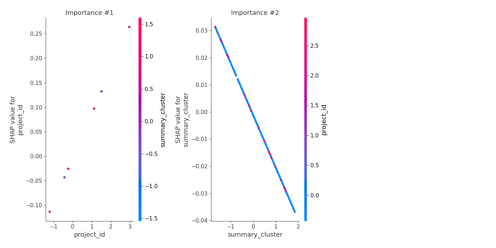
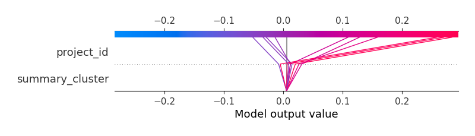
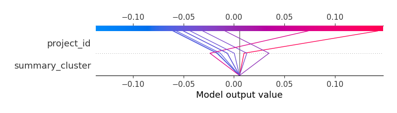

# Summary of 3_Linear

[<< Go back](../README.md)

## Linear Regression (Linear)
- **n_jobs**: -1
- **explain_level**: 2

## Validation
 - **validation_type**: split
 - **train_ratio**: 0.75
 - **shuffle**: True

## Optimized metric
r2

## Training time

5.7 seconds

### Metric details:
| Metric   |           Score |
|:---------|----------------:|
| MAE      | 11732.4         |
| MSE      |     1.78573e+09 |
| RMSE     | 42257.9         |
| R2       |    -0.0345693   |
| MAPE     |     1.88745     |

## Learning curves

## Coefficients
| feature         |   Learner_1 |
|:----------------|------------:|
| project_id      |  0.0904309  |
| intercept       | -7.8419e-16 |
| summary_cluster | -0.0192767  |

## Permutation-based Importance

## True vs Predicted

## Predicted vs Residuals

## SHAP Importance

## SHAP Dependence plots

### Dependence (Fold 1)

## SHAP Decision plots

### Top-10 Worst decisions (Fold 1)

### Top-10 Best decisions (Fold 1)

[<< Go back](../README.md)
